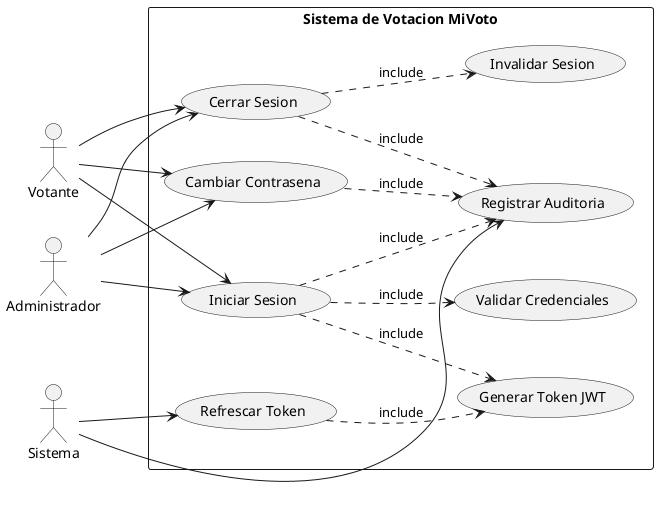
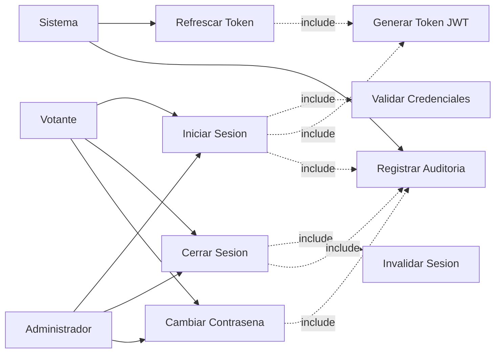

# CU-01: Autenticacion de Usuario

Agrupa todos los flujos relacionados con el acceso de usuarios al sistema: inicio de sesion, cierre, renovacion de tokens y cambio de contrasena.

## Diagrama de Caso de Uso (PlantUML)



## Mapa de Actores y Casos



---

## CU-01.1: Iniciar Sesion

**Actor principal:** Votante, Administrador

**Precondiciones:**
- El usuario debe estar registrado en el sistema
- El usuario debe tener credenciales validas
- El usuario debe estar activo

**Flujo principal:**

1. El usuario accede al endpoint `POST /api/auth/login`
2. El usuario proporciona sus credenciales (username/email y contrasena)
3. El sistema valida las credenciales contra la base de datos
4. El sistema verifica que el usuario este activo
5. El sistema genera un par de tokens JWT (access token y refresh token)
6. El sistema registra el evento de login en la auditoria
7. El sistema actualiza la fecha de ultimo acceso del usuario
8. El sistema retorna los tokens y la informacion del usuario

**Flujos alternativos:**

| Escenario | Condicion | Respuesta |
|---|---|---|
| Credenciales invalidas | Las credenciales no coinciden | `401 Unauthorized` + registro en auditoria |
| Usuario inactivo | El usuario esta desactivado | `403 Forbidden` |
| Cuenta bloqueada | Se excedieron 5 intentos fallidos | `403 Forbidden` (bloqueo de 15 min) |

**Postcondiciones:**
- Se genera una sesion valida con tokens JWT
- Se registra el evento de login en auditoria
- Se actualiza la fecha de ultimo acceso

**Request:**
```json
{
  "username": "string (email o documento)",
  "password": "string"
}
```

**Response 200:**
```json
{
  "success": true,
  "message": "Login exitoso",
  "data": {
    "accessToken": "eyJhbGciOiJIUzI1NiJ9...",
    "refreshToken": "eyJhbGciOiJIUzI1NiJ9...",
    "tokenType": "Bearer",
    "expiresAt": "2025-11-01T18:00:00",
    "user": {
      "id": 1,
      "documentNumber": "12345678",
      "firstName": "Juan",
      "lastName": "Perez",
      "email": "juan@example.com",
      "role": "VOTER",
      "active": true,
      "lastLogin": "2025-11-01T10:00:00"
    }
  }
}
```

**Reglas de negocio:**

| ID | Regla |
|---|---|
| RN-01 | La contrasena debe estar encriptada con BCrypt |
| RN-02 | El access token expira en 8 horas |
| RN-03 | El refresh token expira en 7 dias |
| RN-04 | Maximo 5 intentos fallidos antes de bloqueo temporal (15 minutos) |
| RN-05 | Todos los eventos de autenticacion deben ser auditados |

---

## CU-01.2: Cerrar Sesion

**Actor principal:** Votante, Administrador

**Precondiciones:**
- El usuario debe tener una sesion activa
- El token JWT debe ser valido

**Flujo principal:**

1. El usuario accede al endpoint `POST /api/auth/logout`
2. El sistema valida el token JWT del header Authorization
3. El sistema invalida la sesion actual (blacklist del token en Redis)
4. El sistema registra el evento de logout en auditoria
5. El sistema retorna confirmacion de cierre de sesion

**Postcondiciones:**
- La sesion queda invalidada
- El token queda en blacklist (Redis)
- Se registra el evento en auditoria

---

## CU-01.3: Refrescar Token

**Actor principal:** Sistema (invocado automaticamente por el frontend)

**Precondiciones:**
- El refresh token debe ser valido
- El refresh token no debe estar expirado

**Flujo principal:**

1. El cliente envia el refresh token al endpoint `POST /api/auth/refresh`
2. El sistema valida el refresh token
3. El sistema verifica que no este en blacklist
4. El sistema genera un nuevo access token
5. El sistema retorna el nuevo access token

**Flujo alternativo:** Token invalido o expirado -> `401 Unauthorized`, el cliente debe realizar login nuevamente.

---

## CU-01.4: Cambiar Contrasena

**Actor principal:** Votante, Administrador

**Precondiciones:**
- El usuario debe estar autenticado
- El usuario debe conocer su contrasena actual

**Flujo principal:**

1. El usuario accede al endpoint `POST /api/auth/change-password`
2. El usuario proporciona contrasena actual y nueva contrasena
3. El sistema valida la contrasena actual
4. El sistema valida que la nueva contrasena cumpla politicas de seguridad
5. El sistema encripta la nueva contrasena con BCrypt
6. El sistema actualiza la contrasena en la base de datos
7. El sistema invalida todas las sesiones activas del usuario
8. El sistema registra el cambio en auditoria

**Request:**
```json
{
  "currentPassword": "string",
  "newPassword": "string",
  "confirmPassword": "string"
}
```

**Reglas de negocio:**

| ID | Regla |
|---|---|
| RN-06 | La contrasena debe tener minimo 8 caracteres |
| RN-07 | Debe contener al menos una mayuscula |
| RN-08 | Debe contener al menos un numero |
| RN-09 | Debe contener al menos un caracter especial |
| RN-10 | La nueva contrasena no puede ser igual a las ultimas 3 contrasenas |
