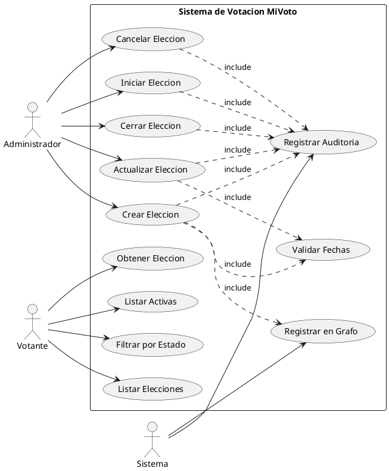
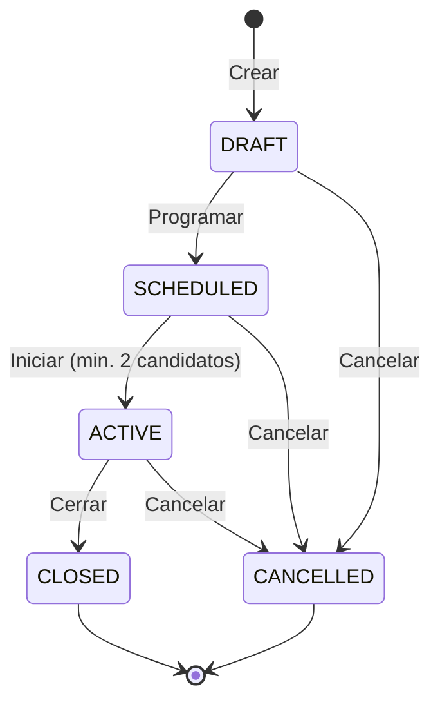

# CU-02: Gestion de Elecciones

Cubre el ciclo de vida completo de una eleccion: creacion, actualizacion, inicio, cierre y cancelacion. Tambien incluye la consulta de elecciones por votantes.

## Diagrama de Caso de Uso (PlantUML)



## Ciclo de Vida de una Eleccion



---

## CU-02.1: Crear Eleccion

**Actor principal:** Administrador

**Precondiciones:**
- El usuario debe estar autenticado con rol ADMIN
- Las fechas deben ser validas y coherentes

**Flujo principal:**

1. El administrador accede al endpoint `POST /api/elections`
2. Proporciona los datos de la eleccion
3. El sistema valida las fechas (inicio < fin, inicio > ahora)
4. El sistema valida que no exista una eleccion con el mismo nombre y fechas
5. El sistema crea la eleccion con estado `DRAFT`
6. El sistema registra la eleccion en `ElectionGraph`
7. El sistema registra el evento en auditoria
8. Retorna la eleccion creada

**Request:**
```json
{
  "title": "string",
  "description": "string",
  "startDate": "datetime (ISO 8601)",
  "endDate": "datetime (ISO 8601)",
  "allowsBlankVote": false,
  "requiresVerification": true
}
```

**Response 201:**
```json
{
  "success": true,
  "message": "Eleccion creada exitosamente",
  "data": {
    "id": 1,
    "title": "Eleccion Municipal 2025",
    "status": "DRAFT",
    "startDate": "2025-11-01T08:00:00",
    "endDate": "2025-11-01T18:00:00",
    "totalVotes": 0,
    "createdAt": "2025-10-01T09:00:00"
  }
}
```

**Reglas de negocio:**

| ID | Regla |
|---|---|
| RN-24 | La fecha de inicio debe ser posterior a la fecha actual |
| RN-25 | La fecha de fin debe ser posterior a la fecha de inicio |
| RN-26 | El nombre de la eleccion debe ser unico para el mismo periodo |
| RN-27 | Las elecciones se organizan en jerarquias mediante `ElectionGraph` |

---

## CU-02.2: Iniciar Eleccion

**Actor principal:** Administrador

**Precondiciones:**
- La eleccion debe estar en estado `SCHEDULED`
- Debe tener al menos 2 candidatos registrados y activos

**Flujo principal:**

1. El administrador accede al endpoint `POST /api/elections/{id}/start`
2. El sistema valida que la eleccion este en estado `SCHEDULED`
3. El sistema verifica que tenga al menos 2 candidatos activos
4. El sistema cambia el estado a `ACTIVE`
5. El sistema invalida el cache de Redis
6. El sistema registra el evento en auditoria

**Reglas de negocio:**

| ID | Regla |
|---|---|
| RN-28 | Una eleccion debe tener minimo 2 candidatos para iniciarse |
| RN-29 | Solo se puede iniciar elecciones en estado `SCHEDULED` |

---

## CU-02.3: Cerrar Eleccion

**Actor principal:** Administrador

**Precondiciones:**
- La eleccion debe estar en estado `ACTIVE`

**Flujo principal:**

1. El administrador accede al endpoint `POST /api/elections/{id}/close`
2. El sistema valida que la eleccion este en estado `ACTIVE`
3. El sistema cambia el estado a `CLOSED`
4. El sistema procesa los votos pendientes en `VoteQueue`
5. El sistema calcula los resultados finales
6. El sistema registra el evento en auditoria

**Reglas de negocio:**

| ID | Regla |
|---|---|
| RN-30 | Solo se pueden cerrar elecciones en estado `ACTIVE` |
| RN-31 | Al cerrar, se procesan todos los votos pendientes en la cola |
| RN-32 | Los resultados quedan disponibles para consulta posterior |

---

## CU-02.4: Listar Elecciones (Votante)

**Actor principal:** Votante (publico)

Los votantes pueden consultar:
- `GET /api/elections` - todas las elecciones
- `GET /api/elections/active` - solo las activas
- `GET /api/elections/{id}` - detalle de una eleccion
- `GET /api/elections/status/{status}` - filtrar por estado
