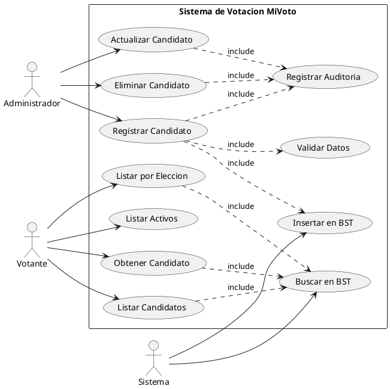
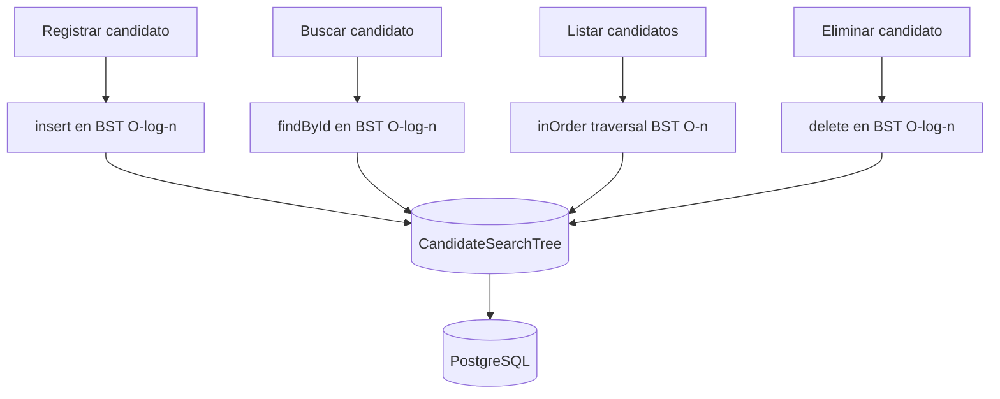

# CU-03: Gestion de Candidatos

Cubre el registro, consulta, actualizacion y eliminacion de candidatos. Incluye la integracion con el arbol binario de busqueda `CandidateSearchTree`.

## Diagrama de Caso de Uso (PlantUML)



## Rol del CandidateSearchTree (BST)



---

## CU-03.1: Registrar Candidato

**Actor principal:** Administrador

**Precondiciones:**
- Autenticado con rol ADMIN
- La eleccion debe existir y no estar en estado `CLOSED` o `CANCELLED`

**Flujo principal:**

1. `POST /api/candidates`
2. El sistema valida que la eleccion exista y acepte candidatos
3. El sistema valida que no exista un candidato con el mismo documento en esa eleccion
4. El sistema crea el candidato con estado activo y `voteCount = 0`
5. El sistema inserta el candidato en `CandidateSearchTree` (BST)
6. El sistema registra el evento en auditoria
7. Retorna el candidato creado

**Request:**
```json
{
  "electionId": 1,
  "number": 1,
  "name": "Juan Perez",
  "party": "Partido A",
  "description": "Candidato con 10 anos de experiencia",
  "photoUrl": "https://storage.mivoto.pe/foto1.jpg"
}
```

**Response 201:**
```json
{
  "success": true,
  "data": {
    "id": 10,
    "number": 1,
    "name": "Juan Perez",
    "party": "Partido A",
    "electionId": 1,
    "active": true,
    "voteCount": 0,
    "createdAt": "2025-10-15T09:00:00"
  }
}
```

**Reglas de negocio:**

| ID | Regla |
|---|---|
| RN-33 | Un candidato no puede estar registrado dos veces en la misma eleccion |
| RN-34 | Los candidatos se organizan en BST para busqueda eficiente O(log n) |
| RN-35 | No se pueden agregar candidatos a elecciones cerradas o canceladas |
| RN-36 | El numero de candidato debe ser unico por eleccion |

---

## CU-03.2: Listar Candidatos por Eleccion

**Actor principal:** Votante (publico)

**Endpoints disponibles:**
- `GET /api/candidates/election/{electionId}` - todos los candidatos
- `GET /api/candidates/election/{electionId}/active` - solo activos
- `GET /api/candidates/election/{electionId}/number/{number}` - por numero de lista

**Estructura de datos utilizada:**

`CandidateSearchTree`: El sistema recorre el BST con `inOrderTraversal()` para obtener candidatos ordenados en O(n). La busqueda por ID individual es O(log n).

---

## CU-03.3: Eliminar Candidato

**Actor principal:** Administrador

**Precondiciones:**
- El candidato no debe tener votos registrados

**Flujo principal:**

1. `DELETE /api/candidates/{id}`
2. El sistema verifica que el candidato no tenga votos
3. El sistema elimina el candidato del BST
4. El sistema elimina el candidato de la base de datos
5. El sistema registra el evento en auditoria

**Flujo alternativo:** Si el candidato tiene votos -> `409 Conflict` ("El candidato tiene votos registrados")

**Reglas de negocio:**

| ID | Regla |
|---|---|
| RN-37 | No se pueden eliminar candidatos con votos registrados |
| RN-38 | La eliminacion debe reflejarse en el BST |
