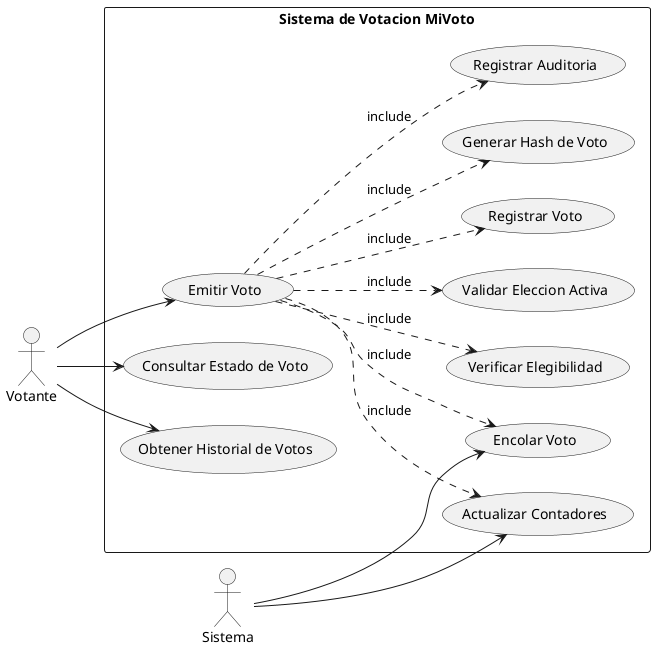
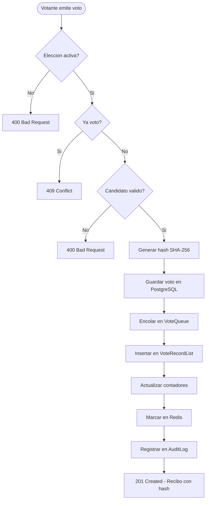

# CU-04: Emision de Voto

El caso de uso central del sistema. Incluye la validacion de elegibilidad, generacion del hash SHA-256, el uso de estructuras de datos y el registro de auditoria.

## Diagrama de Caso de Uso (PlantUML)



## Flujo de Emision de Voto



---

## CU-04.1: Emitir Voto

**Actor principal:** Votante

**Precondiciones:**
- Autenticado con rol VOTER
- La eleccion debe estar en estado `ACTIVE`
- El usuario no debe haber votado previamente en esta eleccion
- El candidato debe pertenecer a la eleccion y estar activo

**Flujo principal:**

1. `POST /api/votes` con `{ electionId, candidateId }`
2. Validar que la eleccion este activa
3. Verificar que el usuario no haya votado (restriccion unica en BD)
4. Validar que el candidato pertenezca a la eleccion y este activo
5. Crear el registro de voto con timestamp e IP
6. Generar hash SHA-256 unico: `SHA256(voteId + timestamp + electionId + salt)`
7. Guardar en PostgreSQL
8. Encolar en `VoteQueue` (FIFO) - O(1)
9. Insertar al inicio de `VoteRecordList` (LinkedList) - O(1)
10. Incrementar `vote_count` del candidato
11. Incrementar `total_votes` de la eleccion
12. Marcar en Redis: `vote:{userId}:{electionId} = true`
13. Registrar en `audit_logs`
14. Retornar recibo con hash

**Request:**
```json
{
  "electionId": 1,
  "candidateId": 10
}
```

**Response 201:**
```json
{
  "success": true,
  "message": "Voto registrado exitosamente",
  "data": {
    "voteId": 42,
    "voteHash": "a3f4b2c1d5e6f7a8b9c0d1e2f3a4b5c6d7e8f9a0b1c2d3e4f5a6b7c8d9e0f1a2",
    "electionId": 1,
    "electionName": "Eleccion Municipal 2025",
    "candidateName": "Juan Perez",
    "timestamp": "2025-11-01T10:30:00",
    "verificationUrl": "/voting/verify?hash=a3f4b2c1..."
  }
}
```

**Flujos alternativos:**

| Condicion | Respuesta |
|---|---|
| Eleccion no activa | `400 Bad Request` |
| Usuario ya voto | `409 Conflict` |
| Candidato no pertenece a la eleccion | `400 Bad Request` |
| Candidato inactivo | `400 Bad Request` |

**Reglas de negocio:**

| ID | Regla |
|---|---|
| RN-11 | Un usuario solo puede votar una vez por eleccion |
| RN-12 | El voto es anonimo (no se almacena relacion directa usuario-candidato) |
| RN-13 | El hash del voto permite verificacion sin revelar identidad |
| RN-14 | Los votos se procesan en orden FIFO mediante `VoteQueue` |
| RN-15 | Todos los votos deben ser auditados |
| RN-16 | El voto no puede ser modificado una vez emitido |

**Estructuras de datos:**

| Estructura | Operacion | Complejidad |
|---|---|---|
| `VoteQueue` | `enqueue(vote)` | O(1) |
| `VoteRecordList` | `addFirst(voteRecord)` | O(1) |

---

## CU-04.2: Consultar Estado de Voto

**Actor principal:** Votante

**Endpoint:** `GET /api/votes/status/{electionId}`

**Response:**
```json
{
  "success": true,
  "data": { "hasVoted": true, "votedAt": "2025-11-01T10:30:00" }
}
```

---

## CU-04.3: Obtener Historial de Votos

**Actor principal:** Votante

**Endpoint:** `GET /api/votes/history`

Retorna todos los votos del usuario autenticado. El historial muestra que el usuario voto (con el hash), pero **no revela por quien voto** (anonimato garantizado por diseno).

**Reglas de negocio:**

| ID | Regla |
|---|---|
| RN-17 | El historial solo muestra que el usuario voto, no por quien |
| RN-18 | El historial se obtiene de `VoteRecordList` (orden cronologico inverso) |
