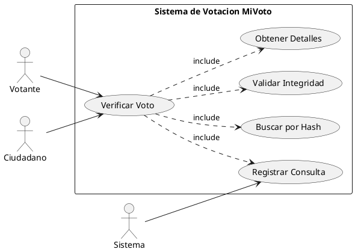
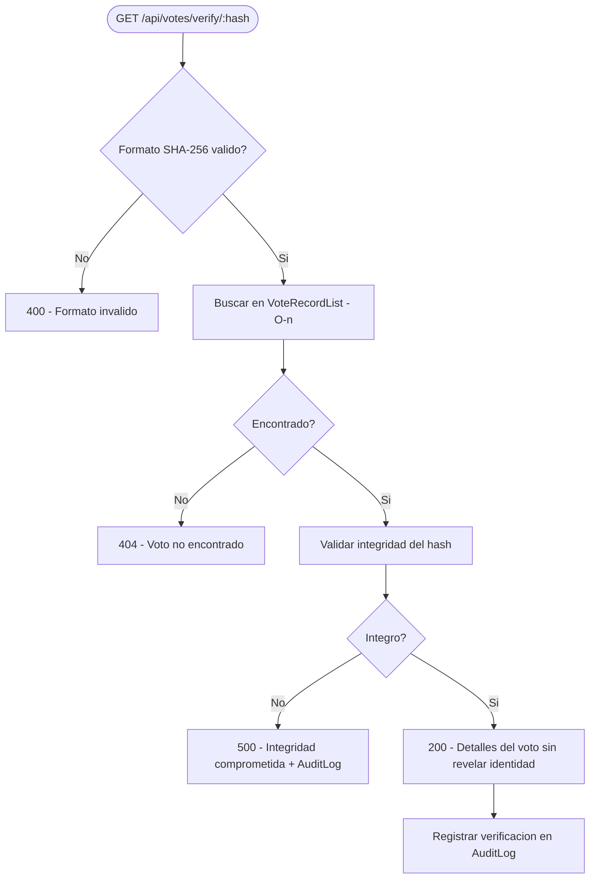

# CU-05: Verificacion de Voto

Permite a cualquier persona (sin autenticacion) verificar la integridad de un voto usando su hash SHA-256. Es un endpoint publico que garantiza transparencia sin comprometer la privacidad del votante.

## Diagrama de Caso de Uso (PlantUML)



## Flujo de Verificacion



---

## CU-05.1: Verificar Voto

**Actor principal:** Votante, Ciudadano (publico, sin autenticacion)

**Precondiciones:**
- El hash del voto debe tener formato valido (64 caracteres hexadecimales)

**Flujo principal:**

1. El usuario accede al endpoint `GET /api/votes/verify/{voteHash}`
2. El sistema valida el formato del hash (patron: `^[a-f0-9]{64}$`)
3. El sistema busca el voto en `VoteRecordList` usando el hash (busqueda lineal O(n))
4. El sistema valida la integridad del voto recalculando el hash
5. El sistema registra la consulta de verificacion en auditoria
6. El sistema retorna los detalles del voto verificado

**Validacion de integridad:**

El hash se recalcula en el servidor usando la misma formula original:

```
SHA256(voteId + timestamp + electionId + salt)
```

Si el hash recalculado coincide con el almacenado, el voto es integro e inmutable.

**Flujos alternativos:**

| Condicion | Respuesta |
|---|---|
| Formato del hash invalido | `400 Bad Request` |
| Voto no encontrado | `404 Not Found` |
| Integridad comprometida | `500 Internal Server Error` + registro en auditoria |

**Response 200:**
```json
{
  "success": true,
  "message": "Voto verificado exitosamente",
  "data": {
    "voteHash": "a3f4b2c1...",
    "electionId": 1,
    "electionName": "Eleccion Municipal 2025",
    "timestamp": "2025-11-01T10:30:00",
    "verified": true
  }
}
```

:::note Privacidad
La respuesta no incluye ningun dato que identifique al votante. Solo se muestra la eleccion, el timestamp y el estado de verificacion.
:::

**Reglas de negocio:**

| ID | Regla |
|---|---|
| RN-19 | La verificacion es publica (no requiere autenticacion) |
| RN-20 | El hash es unico e inmutable |
| RN-21 | La verificacion no debe revelar la identidad del votante |
| RN-22 | Todas las verificaciones deben ser auditadas |
| RN-23 | El sistema puede configurar si muestra o no el candidato votado |

**Estructura de datos utilizada:**

`VoteRecordList` (lista doblemente enlazada):

```
[Head] -> [VoteRecord hash=abc] -> [VoteRecord hash=def] -> [VoteRecord hash=ghi] -> null
```

- **Operacion:** `findByHash(hash)` - O(n) recorrido secuencial desde head
- La busqueda lineal es aceptable dado que la verificacion no es una operacion critica de alto volumen

**Consideraciones de seguridad:**
- No se expone informacion del votante en ninguna respuesta
- Rate limiting aplicado para prevenir ataques de fuerza bruta sobre hashes
- Todas las consultas de verificacion quedan registradas en `audit_logs`
