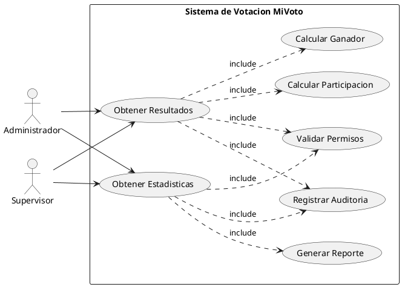
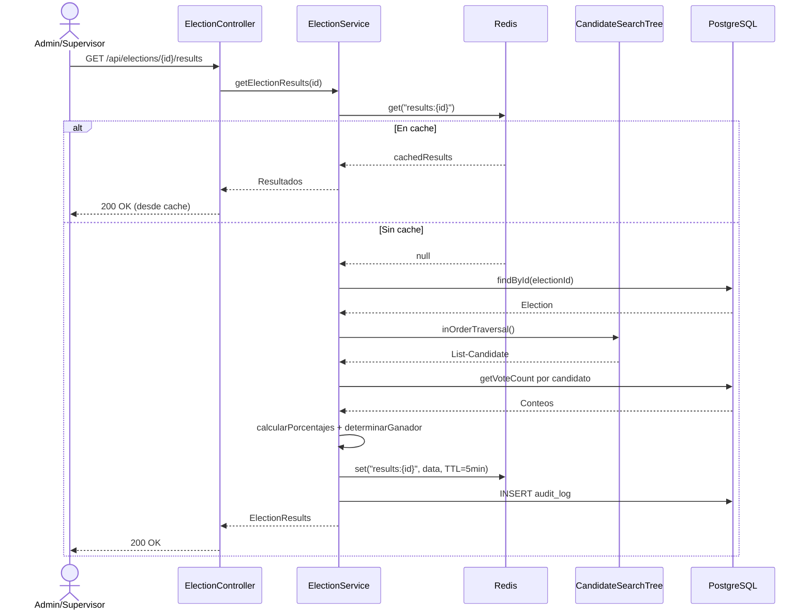

# CU-06: Consulta de Resultados

Permite a Administradores y Supervisores consultar resultados y estadisticas de elecciones. Los resultados se cachean en Redis para optimizar el rendimiento.

## Diagrama de Caso de Uso (PlantUML)



## Flujo de Consulta con Cache



---

## CU-06.1: Obtener Resultados

**Actor principal:** Administrador, Supervisor

**Precondiciones:**
- Autenticado con rol ADMIN o SUPERVISOR
- La eleccion debe existir

**Endpoint:** `GET /api/elections/{id}/results`

**Flujo principal:**

1. El sistema valida los permisos del usuario (ADMIN o SUPERVISOR)
2. Verifica si los resultados estan en cache Redis (`results:{electionId}`)
3. Si no hay cache: obtiene la eleccion y los candidatos via `CandidateSearchTree`
4. Calcula el total de votos por candidato y el porcentaje de cada uno
5. Determina el ganador (candidato con mas votos)
6. Calcula la tasa de participacion (`totalVotes / eligibleVoters * 100`)
7. Guarda los resultados en cache con TTL de 5 minutos (activa) o 24 horas (cerrada)
8. Registra la consulta en auditoria
9. Retorna los resultados

**Response 200:**
```json
{
  "success": true,
  "data": {
    "electionId": 1,
    "electionName": "Eleccion Municipal 2025",
    "status": "CLOSED",
    "totalVotes": 15000,
    "totalEligibleVoters": 20000,
    "participationRate": 75.0,
    "results": [
      {
        "candidateId": 5,
        "candidateName": "Juan Perez",
        "politicalParty": "Partido A",
        "voteCount": 8000,
        "percentage": 53.33,
        "position": 1
      },
      {
        "candidateId": 3,
        "candidateName": "Maria Garcia",
        "politicalParty": "Partido B",
        "voteCount": 7000,
        "percentage": 46.67,
        "position": 2
      }
    ],
    "winner": {
      "candidateId": 5,
      "candidateName": "Juan Perez",
      "voteCount": 8000,
      "percentage": 53.33
    }
  }
}
```

**Estructura de datos utilizada:**

`CandidateSearchTree` (BST): El sistema usa `inOrderTraversal()` para obtener los candidatos en orden. Complejidad O(n).

**Reglas de negocio:**

| ID | Regla |
|---|---|
| RN-39 | Solo ADMIN y SUPERVISOR pueden consultar resultados |
| RN-40 | Los resultados se ordenan por cantidad de votos (descendente) |
| RN-41 | El ganador es el candidato con mas votos |
| RN-42 | Todas las consultas de resultados deben ser auditadas |

---

## CU-06.2: Obtener Estadisticas

**Actor principal:** Administrador, Supervisor

**Endpoints:**
- `GET /api/statistics/election/{id}` - estadisticas de la eleccion
- `GET /api/statistics/election/{id}/candidates` - estadisticas por candidato
- `GET /api/statistics/election/{id}/participation` - participacion por hora
- `GET /api/statistics/system` - estadisticas globales del sistema

**Response de estadisticas por hora:**
```json
{
  "data": {
    "timeSeriesData": [
      { "hour": "08:00", "votes": 1200 },
      { "hour": "09:00", "votes": 2100 },
      { "hour": "10:00", "votes": 3500 },
      { "hour": "11:00", "votes": 2800 }
    ],
    "peakVotingTime": "10:00",
    "votesPerHour": 2400.0
  }
}
```

**Estrategia de cache:**

| Tipo de eleccion | TTL del cache | Clave |
|---|---|---|
| Activa | 5 minutos | `results:{electionId}` |
| Cerrada | 24 horas | `results:{electionId}` |
| Estadisticas sistema | 10 minutos | `stats:system` |

**Reglas de negocio:**

| ID | Regla |
|---|---|
| RN-43 | Las estadisticas incluyen metricas de participacion |
| RN-44 | Se generan datos de series temporales para analisis |
