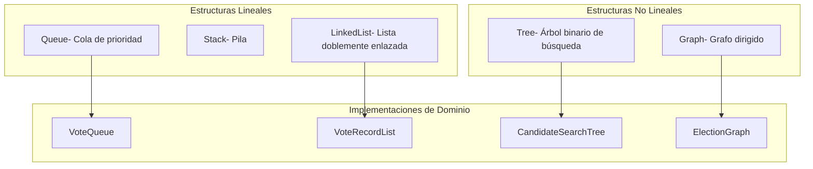
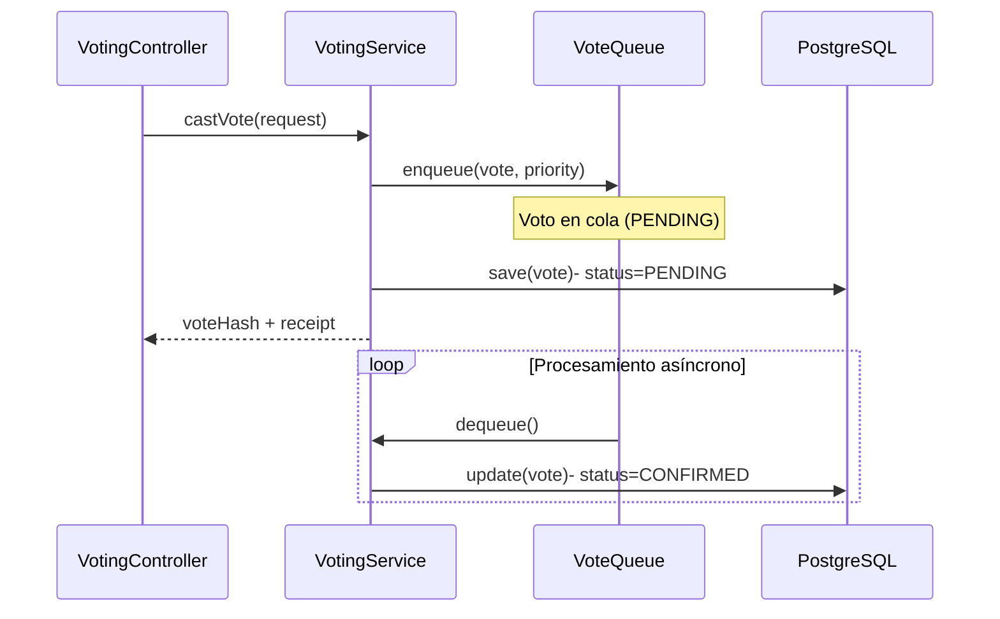
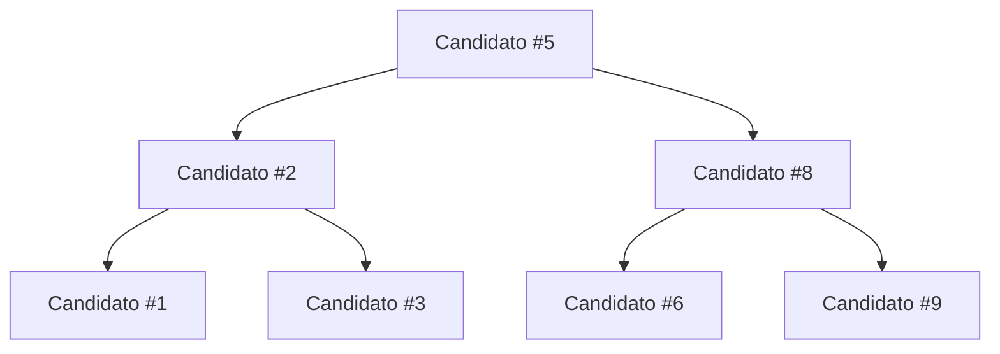
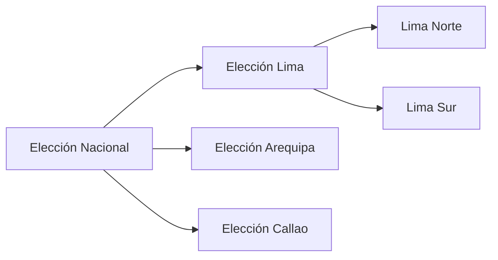

# Estructuras de Datos Personalizadas

MiVoto implementa estructuras de datos personalizadas en el paquete `pe.com.mivoto.service.datastructures`. Estas estructuras son utilizadas activamente en el procesamiento de votos y la gestión de elecciones.

## Visión General



## Estructura de Paquetes

```
pe.com.mivoto.service.datastructures/
├── linear/
│   ├── queue/         - Cola de prioridad genérica
│   ├── stack/         - Pila genérica
│   └── linkedlist/    - Lista doblemente enlazada genérica
├── nonlinear/
│   ├── tree/          - Nodos de árbol binario de búsqueda
│   └── graph/         - Grafos dirigidos/no dirigidos
└── implementations/
    ├── VoteQueue       - Cola de votos pendientes
    ├── VoteRecordList  - Lista de registros de auditoría
    ├── CandidateSearchTree- BST de candidatos por número
    └── ElectionGraph   - Grafo jerárquico de elecciones
```

---

## VoteQueue- Cola de Votos

### Descripción

`VoteQueue` es una **cola de prioridad** que gestiona los votos pendientes de procesamiento. Los votos se procesan en orden FIFO, con posibilidad de priorización por tipo.

### Uso en el Sistema



### Características

- **Tipo:** Cola de prioridad basada en heap
- **Prioridad:** Los votos se pueden priorizar por tipo o timestamp
- **Tamaño:** Visible en `/api/health/detailed` vía `voteQueueSize`
- **Thread-safety:** Sincronización para acceso concurrente

---

## VoteRecordList- Lista de Registros de Votos

### Descripción

`VoteRecordList` es una **lista doblemente enlazada** que mantiene el rastro de auditoría de votos. Permite navegación bidireccional y acceso eficiente para auditoría.

### Uso en el Sistema

- Almacena registros inmutables de cada voto procesado
- Permite recorrer el historial en cualquier dirección
- Se sincroniza periódicamente con la tabla `vote_records`
- Tamaño visible en `/api/health/detailed` vía `voteRecordListSize`

### Operaciones

| Operación | Complejidad | Descripción |
|---|---|---|
| `addFirst(record)` | O(1) | Agrega al inicio de la lista |
| `addLast(record)` | O(1) | Agrega al final de la lista |
| `removeFirst()` | O(1) | Elimina el primer elemento |
| `get(index)` | O(n) | Acceso por índice |
| `size()` | O(1) | Tamaño de la lista |

---

## CandidateSearchTree- Árbol de Búsqueda de Candidatos

### Descripción

`CandidateSearchTree` es un **árbol binario de búsqueda (BST)** que indexa los candidatos por su número de lista. Permite búsquedas eficientes O(log n) comparado con O(n) de una búsqueda lineal.

### Uso en el Sistema



- Al iniciar una elección, todos los candidatos se insertan en el árbol
- Las búsquedas por número de candidato usan el árbol en lugar de la BD
- Tamaño visible en `/api/health/detailed` vía `candidateTreeSize`

### Operaciones

| Operación | Complejidad Promedio | Descripción |
|---|---|---|
| `insert(candidate)` | O(log n) | Inserta un candidato |
| `search(number)` | O(log n) | Busca por número de lista |
| `delete(number)` | O(log n) | Elimina un candidato |
| `inOrder()` | O(n) | Retorna candidatos ordenados por número |
| `size()` | O(1) | Total de candidatos en el árbol |

---

## ElectionGraph- Grafo de Elecciones

### Descripción

`ElectionGraph` es un **grafo dirigido** que modela relaciones jerárquicas entre elecciones. Por ejemplo, una elección nacional puede contener sub-elecciones regionales.

### Uso en el Sistema



### Características

- **Tipo:** Grafo dirigido acíclico (DAG)
- **Representación:** Lista de adyacencia
- **Uso:** Modelar jerarquías electorales (nacional → regional → local)
- **Algoritmos:** BFS para recorrer niveles, DFS para análisis de árbol

### Operaciones

| Operación | Complejidad | Descripción |
|---|---|---|
| `addVertex(election)` | O(1) | Agrega una elección |
| `addEdge(parent, child)` | O(1) | Relaciona dos elecciones |
| `getChildren(election)` | O(V) | Sub-elecciones de una elección |
| `bfs(root)` | O(V+E) | Recorrido por niveles |
| `dfs(root)` | O(V+E) | Recorrido en profundidad |

---

## Monitoreo en Tiempo Real

Las métricas de las estructuras de datos están expuestas en el endpoint de salud:

**GET `/api/health/detailed`:**

```json
{
  "status": "UP",
  "dataStructures": {
    "voteQueue": {
      "size": 45,
      "type": "PriorityQueue"
    },
    "voteRecordList": {
      "size": 45230,
      "type": "DoublyLinkedList"
    },
    "candidateSearchTree": {
      "size": 87,
      "type": "BinarySearchTree"
    },
    "electionGraph": {
      "vertices": 15,
      "edges": 12,
      "type": "DirectedGraph"
    }
  }
}
```
