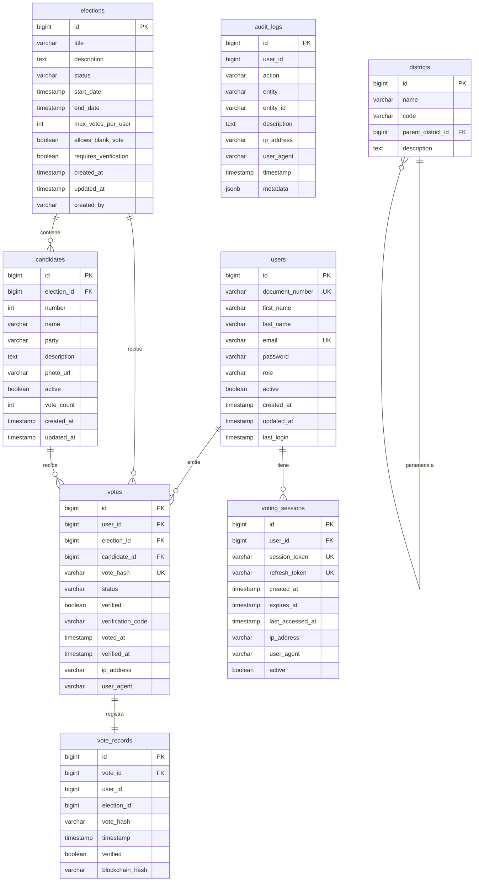
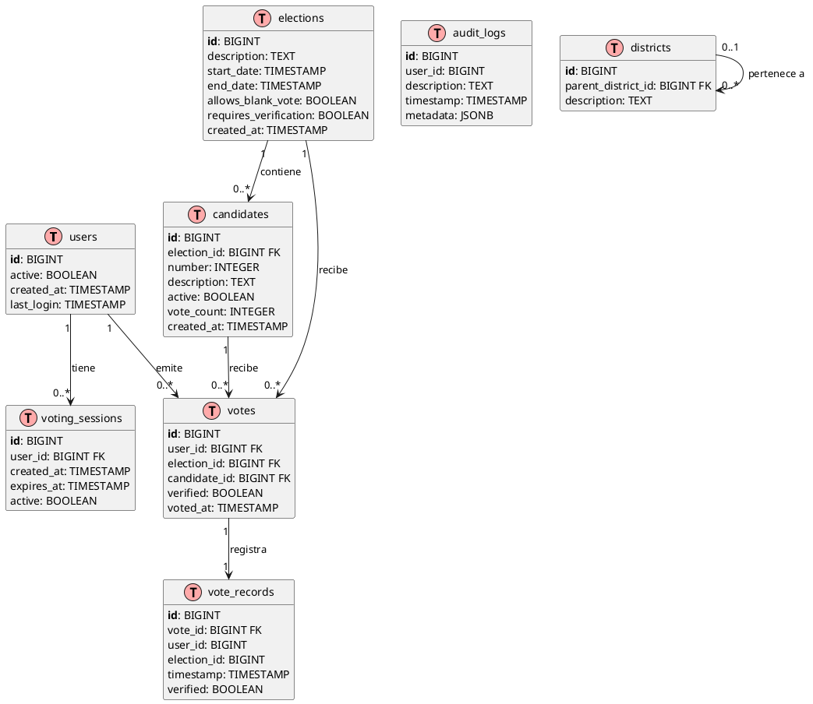

# Base de Datos

MiVoto utiliza **PostgreSQL** como base de datos principal, con **Flyway** para el versionado del esquema. Las migraciones se encuentran en `src/main/resources/db/migration/`.

## Diagrama Entidad-Relación (Mermaid)



## Diagrama Entidad-Relación (PlantUML)



## Descripción de Entidades

### `users`- Usuarios del Sistema

Almacena todos los usuarios del sistema independientemente de su rol.

| Columna | Tipo | Restricción | Descripción |
|---|---|---|---|
| `id` | BIGINT | PK, AUTO | Identificador único |
| `document_number` | VARCHAR(20) | UNIQUE, INDEX | DNI/Documento de identidad |
| `first_name` | VARCHAR(100) | NOT NULL | Nombre |
| `last_name` | VARCHAR(100) | NOT NULL | Apellido |
| `email` | VARCHAR(150) | UNIQUE, INDEX | Correo electrónico |
| `password` | VARCHAR(255) | NOT NULL | Hash BCrypt de la contraseña |
| `role` | VARCHAR(20) | NOT NULL | `VOTER`, `ADMIN`, `SUPERVISOR`, `AUDITOR` |
| `active` | BOOLEAN | DEFAULT true | Estado de la cuenta |
| `created_at` | TIMESTAMP | NOT NULL | Fecha de creación |
| `updated_at` | TIMESTAMP |- | Última actualización |
| `last_login` | TIMESTAMP |- | Último inicio de sesión |

**Índices:** `document_number`, `email`

---

### `elections`- Elecciones

Representa cada proceso electoral con su ciclo de vida completo.

| Columna | Tipo | Restricción | Descripción |
|---|---|---|---|
| `id` | BIGINT | PK, AUTO | Identificador único |
| `title` | VARCHAR(200) | NOT NULL | Título de la elección |
| `description` | TEXT |- | Descripción detallada |
| `status` | VARCHAR(20) | NOT NULL | `DRAFT`, `SCHEDULED`, `ACTIVE`, `CLOSED`, `CANCELLED` |
| `start_date` | TIMESTAMP | NOT NULL | Inicio de la votación |
| `end_date` | TIMESTAMP | NOT NULL | Cierre de la votación |
| `max_votes_per_user` | INT | DEFAULT 1 | Máximo de votos por usuario |
| `allows_blank_vote` | BOOLEAN | DEFAULT false | Permite voto en blanco |
| `requires_verification` | BOOLEAN | DEFAULT false | Requiere verificación post-voto |
| `created_at` | TIMESTAMP | NOT NULL | Fecha de creación |
| `created_by` | VARCHAR(100) | NOT NULL | Usuario creador |

**Índices:** `status`, `(start_date, end_date)`

---

### `candidates`- Candidatos

Candidatos vinculados a una elección específica.

| Columna | Tipo | Restricción | Descripción |
|---|---|---|---|
| `id` | BIGINT | PK, AUTO | Identificador único |
| `election_id` | BIGINT | FK, NOT NULL | Referencia a `elections` |
| `number` | INT | NOT NULL | Número de lista del candidato |
| `name` | VARCHAR(150) | NOT NULL | Nombre completo |
| `party` | VARCHAR(100) |- | Partido o agrupación |
| `description` | TEXT |- | Descripción del candidato |
| `photo_url` | VARCHAR(500) |- | URL de la foto |
| `active` | BOOLEAN | DEFAULT true | Estado del candidato |
| `vote_count` | INT | DEFAULT 0 | Contador de votos recibidos |

**Restricción única:** `(election_id, number)`- el número de candidato es único por elección.

**Índices:** `election_id`, `(election_id, number)`

---

### `votes`- Votos

Registro de cada voto emitido. La integridad se garantiza con un hash SHA-256.

| Columna | Tipo | Restricción | Descripción |
|---|---|---|---|
| `id` | BIGINT | PK, AUTO | Identificador único |
| `user_id` | BIGINT | FK, NOT NULL | Usuario votante |
| `election_id` | BIGINT | FK, NOT NULL | Elección correspondiente |
| `candidate_id` | BIGINT | FK | Candidato elegido (NULL = voto en blanco) |
| `vote_hash` | VARCHAR(64) | UNIQUE | Hash SHA-256 del voto |
| `status` | VARCHAR(20) | NOT NULL | `PENDING`, `CONFIRMED`, `REJECTED`, `UNDER_REVIEW` |
| `verified` | BOOLEAN | DEFAULT false | Si fue verificado por el votante |
| `verification_code` | VARCHAR(50) |- | Código de verificación |
| `voted_at` | TIMESTAMP | NOT NULL | Momento del voto |
| `ip_address` | VARCHAR(45) |- | IP del votante |
| `user_agent` | VARCHAR(500) |- | Navegador del votante |

**Restricción única:** `(user_id, election_id)`- previene el doble voto.

**Índices:** `(user_id, election_id)`, `election_id`, `vote_hash`

---

### `vote_records`- Registros de Votos

Rastro de auditoría inmutable de cada voto. Complementa la tabla `votes`.

| Columna | Tipo | Descripción |
|---|---|---|
| `id` | BIGINT | PK |
| `vote_id` | BIGINT | FK a `votes` |
| `vote_hash` | VARCHAR(64) | Hash del voto (redundante para auditoría) |
| `timestamp` | TIMESTAMP | Momento del registro |
| `verified` | BOOLEAN | Estado de verificación |
| `blockchain_hash` | VARCHAR(128) | Hash opcional de blockchain |

---

### `voting_sessions`- Sesiones de Votación

Gestiona las sesiones JWT de los usuarios autenticados.

| Columna | Tipo | Descripción |
|---|---|---|
| `id` | BIGINT | PK |
| `user_id` | BIGINT | FK a `users` |
| `session_token` | VARCHAR(500) | JWT de acceso (UNIQUE) |
| `refresh_token` | VARCHAR(500) | JWT de refresco (UNIQUE) |
| `created_at` | TIMESTAMP | Creación de la sesión |
| `expires_at` | TIMESTAMP | Expiración |
| `last_accessed_at` | TIMESTAMP | Último acceso |
| `ip_address` | VARCHAR(45) | IP de origen |
| `active` | BOOLEAN | Estado de la sesión |

---

### `audit_logs`- Registros de Auditoría

Log completo e inmutable de todas las acciones relevantes del sistema.

| Columna | Tipo | Descripción |
|---|---|---|
| `id` | BIGINT | PK |
| `user_id` | BIGINT | Usuario que realizó la acción |
| `action` | VARCHAR(50) | Tipo de acción (ver enumeración) |
| `entity` | VARCHAR(100) | Entidad afectada |
| `entity_id` | VARCHAR(100) | ID de la entidad afectada |
| `description` | TEXT | Descripción detallada |
| `ip_address` | VARCHAR(45) | IP del cliente |
| `user_agent` | VARCHAR(500) | Navegador del cliente |
| `timestamp` | TIMESTAMP | Momento de la acción |
| `metadata` | JSONB | Datos adicionales en JSON |

**Acciones registradas:** `LOGIN`, `LOGOUT`, `VOTE_CAST`, `VOTE_VERIFIED`, `ELECTION_CREATED`, `ELECTION_UPDATED`, `ELECTION_STARTED`, `ELECTION_CLOSED`, `USER_CREATED`, `USER_UPDATED`, `PASSWORD_CHANGED`

---

### `districts`- Distritos

Estructura jerárquica de distritos electorales.

| Columna | Tipo | Descripción |
|---|---|---|
| `id` | BIGINT | PK |
| `name` | VARCHAR(100) | Nombre del distrito |
| `code` | VARCHAR(20) | Código único |
| `parent_district_id` | BIGINT | FK autorreferencial (distrito padre) |
| `description` | TEXT | Descripción |

## Enumeraciones

### Estado de Elección (`ElectionStatus`)

```
DRAFT → SCHEDULED → ACTIVE → CLOSED
                ↘              ↗
               CANCELLED ←────
```

| Valor | Descripción |
|---|---|
| `DRAFT` | Borrador, editable pero no visible públicamente |
| `SCHEDULED` | Programada, esperando fecha de inicio |
| `ACTIVE` | En curso, aceptando votos |
| `CLOSED` | Finalizada, resultados disponibles |
| `CANCELLED` | Cancelada en cualquier estado previo |

### Estado de Voto (`VoteStatus`)

| Valor | Descripción |
|---|---|
| `PENDING` | Voto recibido, pendiente de confirmación |
| `CONFIRMED` | Voto confirmado y registrado |
| `REJECTED` | Voto rechazado (fraude detectado, duplicado) |
| `UNDER_REVIEW` | En revisión por irregularidades |

## Migraciones Flyway

Las migraciones se ubican en `src/main/resources/db/migration/` con el formato:

```
V1__create_users_table.sql
V2__create_elections_table.sql
V3__create_candidates_table.sql
V4__create_votes_table.sql
V5__create_audit_logs_table.sql
...
```
