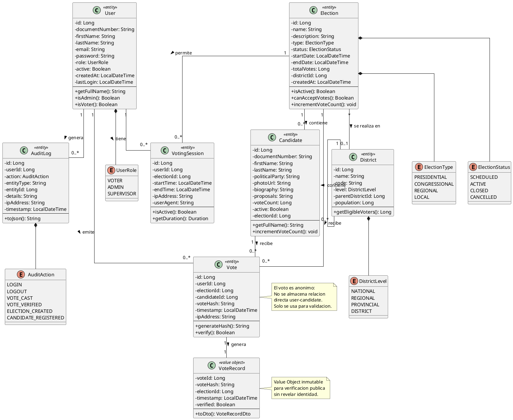
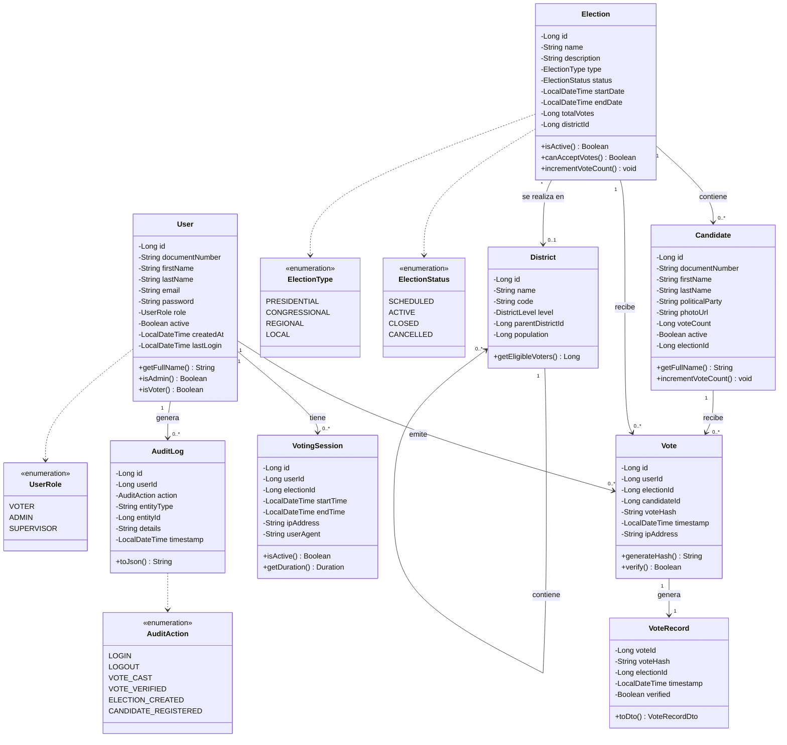

# DC-01: Modelo de Dominio

Diagrama de clases del modelo de dominio de MiVoto. Incluye las 7 entidades principales (`User`, `Election`, `Candidate`, `Vote`, `VoteRecord`, `VotingSession`, `District`, `AuditLog`), sus value objects y las 5 enumeraciones del sistema.

## Diagrama de Clases (PlantUML)

## Diagrama de Clases (Mermaid)

---

## Entidades Principales

### User - Usuario

Representa a los usuarios del sistema con sus credenciales y rol asignado.

| Campo | Tipo | Descripcion |
|---|---|---|
| documentNumber | String | DNI o documento de identidad unico |
| role | UserRole | VOTER, ADMIN o SUPERVISOR |
| active | Boolean | Controla el acceso al sistema |
| lastLogin | LocalDateTime | Timestamp del ultimo acceso |

### Election - Eleccion

Representa un proceso electoral con su ciclo de vida completo.

| Estado | Descripcion |
|---|---|
| SCHEDULED | Creada, pendiente de inicio |
| ACTIVE | En curso, acepta votos |
| CLOSED | Finalizada, resultados disponibles |
| CANCELLED | Cancelada por el administrador |

### Candidate - Candidato

Candidato registrado en una eleccion especifica. Mantiene un contador de votos que se incrementa atomicamente.

### Vote - Voto

Registro del acto de votacion. El campo `voteHash` (SHA-256) permite verificacion posterior sin revelar la identidad del votante. El campo `candidateId` solo se usa para conteos, no para rastrear quien voto por quien desde el exterior.

### VoteRecord - Registro de Voto

Value Object inmutable que encapsula los datos minimos necesarios para la verificacion publica de un voto. Se almacena en `VoteRecordList` (lista enlazada en memoria).

### VotingSession - Sesion de Votacion

Rastrea las sesiones activas de votacion para deteccion de anomalias y auditoria de acceso.

### District - Distrito

Organizacion territorial jerarquica con auto-referencia (un distrito puede contener sub-distritos). Los niveles van de NATIONAL a DISTRICT.

### AuditLog - Registro de Auditoria

Registro inmutable de todas las acciones criticas del sistema. No se modifica ni elimina una vez creado.

## Enumeraciones

| Enum | Valores |
|---|---|
| UserRole | VOTER, ADMIN, SUPERVISOR |
| ElectionType | PRESIDENTIAL, CONGRESSIONAL, REGIONAL, LOCAL |
| ElectionStatus | SCHEDULED, ACTIVE, CLOSED, CANCELLED |
| DistrictLevel | NATIONAL, REGIONAL, PROVINCIAL, DISTRICT |
| AuditAction | LOGIN, LOGOUT, VOTE_CAST, VOTE_VERIFIED, ELECTION_CREATED, CANDIDATE_REGISTERED |

## Reglas de Integridad

1. **Unicidad de voto**: Un usuario solo puede votar una vez por eleccion (restriccion UNIQUE en BD)
2. **Anonimato**: No se almacena relacion directa usuario-candidato accesible desde el exterior
3. **Inmutabilidad**: Los votos no pueden modificarse una vez emitidos
4. **Verificabilidad**: Todo voto genera un hash unico para verificacion publica
5. **Auditoria**: Todas las acciones criticas se registran en `AuditLog`
