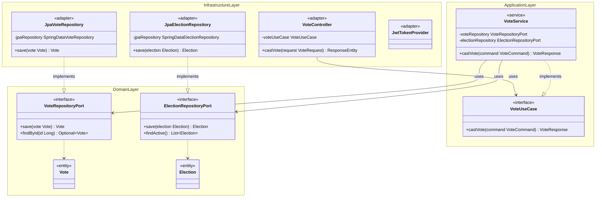

# DC-02: Arquitectura Hexagonal (Ports and Adapters)

Diagrama de clases que muestra como se aplica la arquitectura hexagonal en MiVoto. Las dependencias fluyen siempre hacia adentro: Infraestructura depende de Aplicacion, Aplicacion depende de Dominio. El Dominio no depende de nadie.

## Diagrama de Clases (PlantUML)

```plantuml
@startuml
skinparam packageStyle rectangle
skinparam linetype ortho

package "Domain Layer" {
    interface VoteRepositoryPort <<port>> {
        + save(vote: Vote): Vote
        + findById(id: Long): Optional<Vote>
    }

    interface ElectionRepositoryPort <<port>> {
        + save(election: Election): Election
        + findActive(): List<Election>
    }

    class Vote <<entity>>
    class Election <<entity>>

    VoteRepositoryPort ..> Vote
    ElectionRepositoryPort ..> Election
}

package "Application Layer" {
    interface VoteUseCase <<port>> {
        + castVote(command: VoteCommand): VoteResponse
    }

    class VoteService <<service>> {
        - voteRepository: VoteRepositoryPort
        - electionRepository: ElectionRepositoryPort
        + castVote(command: VoteCommand): VoteResponse
    }

    VoteService ..|> VoteUseCase
    VoteService --> VoteRepositoryPort
    VoteService --> ElectionRepositoryPort
}

package "Infrastructure Layer" {
    package "Persistence Adapter" {
        class JpaVoteRepository <<adapter>> {
            - jpaRepository: SpringDataVoteRepository
            + save(vote: Vote): Vote
        }

        class JpaElectionRepository <<adapter>> {
            - jpaRepository: SpringDataElectionRepository
            + save(election: Election): Election
        }
    }

    package "Security Adapter" {
        class JwtTokenProvider <<adapter>>
        class SecurityConfig <<config>>
    }

    package "REST Adapter" {
        class VoteController <<adapter>> {
            - voteUseCase: VoteUseCase
            + castVote(request: VoteRequest): ResponseEntity
        }
    }
}

' Relaciones entre capas
JpaVoteRepository ..|> VoteRepositoryPort
JpaElectionRepository ..|> ElectionRepositoryPort

VoteController --> VoteUseCase

note right of VoteUseCase
  Input Port (Driver Port)
  Define la API publica de la aplicacion
end note

note right of VoteRepositoryPort
  Output Port (Driven Port)
  Define la interfaz para persistencia
end note

note right of JpaVoteRepository
  Adapter (Driven Adapter)
  Implementa la persistencia usando JPA
end note

note right of VoteController
  Adapter (Driver Adapter)
  Expone la funcionalidad via REST
end note

@enduml
```



## Diagrama de Clases (Mermaid)



---

## Las Tres Capas

### Domain Layer - Nucleo del sistema

Contiene la logica de negocio pura y las entidades del dominio. **No tiene ninguna dependencia externa** - no importa Spring, JPA ni ninguna libreria de infraestructura.

- **Entidades**: `Vote`, `Election`, `Candidate`, `User`, `AuditLog`
- **Output Ports (Driven Ports)**: Interfaces como `VoteRepositoryPort`, `ElectionRepositoryPort` - definen como el dominio necesita interactuar con el exterior (bases de datos, servicios externos)

### Application Layer - Orquestacion de casos de uso

Orquesta los casos de uso utilizando las entidades del dominio y los puertos. Solo depende de la capa de Dominio.

- **Input Ports (Driver Ports)**: Interfaces como `VoteUseCase` - definen que puede hacer el sistema
- **Servicios**: `VoteService`, `ElectionService`, `AuthService` - implementan los casos de uso coordinando entidades y puertos

### Infrastructure Layer - Adaptadores tecnologicos

Implementa las interfaces definidas en Dominio y Aplicacion, conectando el sistema con tecnologias externas.

- **Persistence Adapters**: `JpaVoteRepository`, `JpaElectionRepository` - implementan los Output Ports usando Spring Data JPA
- **REST Adapters**: `VoteController`, `ElectionController` - reciben peticiones HTTP y delegan en los Input Ports
- **Security Adapters**: `JwtTokenProvider`, `SecurityConfig` - implementan la autenticacion y autorizacion

## La Regla de Dependencia

Las flechas de dependencia solo apuntan hacia adentro:

```
Infrastructure --> Application --> Domain
```

Esto garantiza que:
- Cambiar la base de datos (PostgreSQL por MongoDB) no afecta la logica de negocio
- Cambiar el framework web (Spring MVC por otro) no afecta los servicios
- Los casos de uso son testables en aislamiento sin infraestructura real

## Tipos de Puertos y Adaptadores

| Tipo | Ejemplo | Descripcion |
|---|---|---|
| Input Port (Driver Port) | `VoteUseCase` | API publica que define lo que el sistema puede hacer |
| Output Port (Driven Port) | `VoteRepositoryPort` | Interfaz que el dominio necesita del exterior |
| Driver Adapter | `VoteController` | Llama al sistema (REST, CLI, eventos) |
| Driven Adapter | `JpaVoteRepository` | El sistema lo llama (BD, APIs externas, cache) |

## Beneficios en MiVoto

- **Testabilidad**: `VoteService` se puede probar con mocks de `VoteRepositoryPort` sin necesitar PostgreSQL
- **Flexibilidad**: Si se cambia Redis por Hazelcast, solo cambia el adaptador, no los servicios
- **Claridad**: Las interfaces de puertos documentan exactamente que necesita cada capa del exterior
