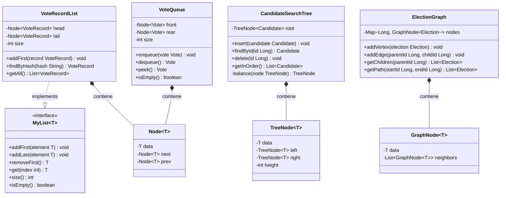

# DC-03: Estructuras de Datos Personalizadas

Diagrama de clases de las cuatro estructuras de datos implementadas a medida en MiVoto. Dos lineales (`VoteRecordList`, `VoteQueue`) y dos no lineales (`CandidateSearchTree`, `ElectionGraph`), todas con sus nodos genericos internos.

## Diagrama de Clases (PlantUML)

```plantuml
@startuml
skinparam classAttributeIconSize 0

package "Estructuras Lineales" {
    interface MyList~T~ {
        + addFirst(element: T): void
        + addLast(element: T): void
        + removeFirst(): T
        + get(index: int): T
        + size(): int
        + isEmpty(): boolean
    }

    class Node~T~ {
        - data: T
        - next: Node~T~
        - prev: Node~T~
    }

    class VoteRecordList {
        - head: Node~VoteRecord~
        - tail: Node~VoteRecord~
        - size: int
        --
        + addFirst(record: VoteRecord): void
        + findByHash(hash: String): VoteRecord
        + getAll(): List~VoteRecord~
    }

    class VoteQueue {
        - front: Node~Vote~
        - rear: Node~Vote~
        - size: int
        --
        + enqueue(vote: Vote): void
        + dequeue(): Vote
        + peek(): Vote
        + isEmpty(): boolean
    }

    VoteRecordList ..|> MyList
    VoteRecordList *-- Node
    VoteQueue *-- Node
}

package "Estructuras No Lineales" {
    class TreeNode~T~ {
        - data: T
        - left: TreeNode~T~
        - right: TreeNode~T~
        - height: int
    }

    class CandidateSearchTree {
        - root: TreeNode~Candidate~
        --
        + insert(candidate: Candidate): void
        + findById(id: Long): Candidate
        + delete(id: Long): void
        + getInOrder(): List~Candidate~
        - balance(node: TreeNode): TreeNode
    }

    class GraphNode~T~ {
        - data: T
        - neighbors: List~GraphNode~T~~
    }

    class ElectionGraph {
        - nodes: Map~Long, GraphNode~Election~~
        --
        + addVertex(election: Election): void
        + addEdge(parentId: Long, childId: Long): void
        + getChildren(parentId: Long): List~Election~
        + getPath(startId: Long, endId: Long): List~Election~
    }

    CandidateSearchTree *-- TreeNode
    ElectionGraph *-- GraphNode
}

note bottom of VoteRecordList
  Lista Doblemente Enlazada.
  Insercion rapida en cabeza O(1).
  Busqueda por hash lineal O(n).
end note

note bottom of VoteQueue
  Cola FIFO (First-In-First-Out).
  enqueue/dequeue ambos O(1).
end note

note bottom of CandidateSearchTree
  Arbol Binario de Busqueda (BST).
  Busqueda, insercion y eliminacion O(log n).
end note

note bottom of ElectionGraph
  Grafo Dirigido con lista de adyacencia.
  Modela jerarquias: Nacional -> Regional -> Local.
end note

@enduml
```



## Diagrama de Clases (Mermaid)



---

## Descripcion de Cada Estructura

### 1. VoteRecordList - Lista Doblemente Enlazada

Almacena el historial cronologico de votos para auditoria y verificacion publica.

**Estructura interna:**
```
[Head] --> [VoteRecord hash=abc] --> [VoteRecord hash=def] --> null
           timestamp=08:01          timestamp=08:02
 ^
[Tail]
```

| Operacion | Complejidad | Uso |
|---|---|---|
| `addFirst(record)` | O(1) | Insertar un nuevo voto al principio |
| `findByHash(hash)` | O(n) | Verificacion publica de votos |
| `getAll()` | O(n) | Exportar historial completo |

- La insercion al inicio es O(1) porque se mantiene referencia al `head`
- La busqueda lineal O(n) es aceptable ya que la verificacion no es una operacion de alto volumen

### 2. VoteQueue - Cola FIFO

Buffer para el procesamiento ordenado de votos. Garantiza que los votos se procesen en el mismo orden en que fueron recibidos.

**Estructura interna:**
```
front --> [Vote1] --> [Vote2] --> [Vote3] --> null
                                              ^
                                            rear
```

| Operacion | Complejidad | Uso |
|---|---|---|
| `enqueue(vote)` | O(1) | Agregar voto al final de la cola |
| `dequeue()` | O(1) | Procesar el siguiente voto |
| `peek()` | O(1) | Consultar el proximo voto sin extraerlo |

- Implementada con nodos enlazados para evitar redimensionamiento de arrays
- Procesa votos en orden FIFO garantizando equidad temporal

### 3. CandidateSearchTree - Arbol Binario de Busqueda

Organiza los candidatos de una eleccion para permitir busquedas eficientes por ID. Puede incluir logica de balanceo (tipo AVL).

**Estructura interna:**
```
        [Candidato ID=5]
       /                 \
  [ID=3]               [ID=7]
     \                 /
   [ID=4]           [ID=6]
```

| Operacion | Complejidad promedio | Complejidad peor caso |
|---|---|---|
| `insert(candidate)` | O(log n) | O(n) si degenera |
| `findById(id)` | O(log n) | O(n) |
| `delete(id)` | O(log n) | O(n) |
| `getInOrder()` | O(n) | O(n) |

- El recorrido in-order devuelve los candidatos en orden de ID
- Se usa para listar candidatos de una eleccion y para consultar resultados

### 4. ElectionGraph - Grafo Dirigido

Modela jerarquias entre elecciones usando lista de adyacencia. Permite navegar relaciones padre-hijo entre tipos de eleccion.

**Estructura interna:**
```
{ 1: GraphNode(Nacional) --> [GraphNode(Regional A), GraphNode(Regional B)] }
{ 2: GraphNode(Regional A) --> [GraphNode(Local 1), GraphNode(Local 2)] }
{ 3: GraphNode(Regional B) --> [GraphNode(Local 3)] }
```

| Operacion | Complejidad | Uso |
|---|---|---|
| `addVertex(election)` | O(1) | Registrar nueva eleccion |
| `addEdge(parent, child)` | O(1) | Establecer jerarquia |
| `getChildren(parentId)` | O(V+E) | Obtener elecciones hijas |
| `getPath(start, end)` | O(V+E) | Recorrido BFS/DFS |

## Resumen de Complejidades

| Estructura | Insercion | Busqueda | Eliminacion |
|---|---|---|---|
| VoteRecordList | O(1) al inicio | O(n) lineal | O(n) |
| VoteQueue | O(1) enqueue | O(1) dequeue | O(1) |
| CandidateSearchTree | O(log n) | O(log n) | O(log n) |
| ElectionGraph | O(1) addVertex | O(V+E) | O(V+E) |
