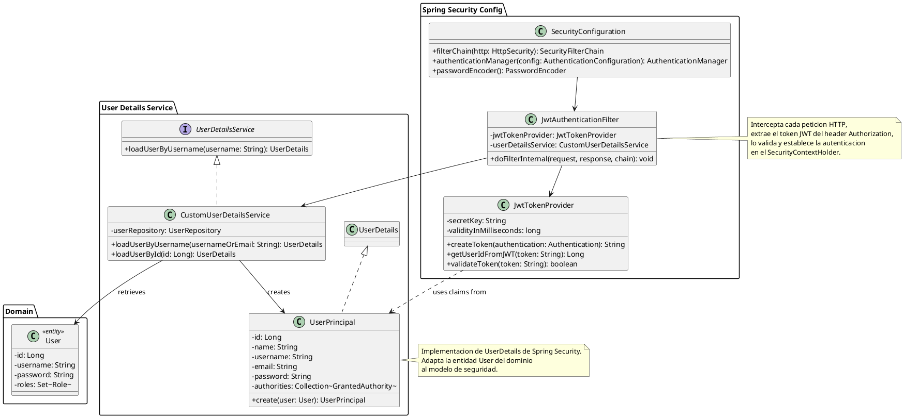
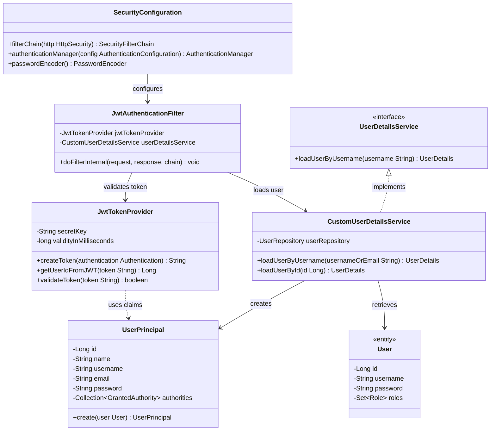
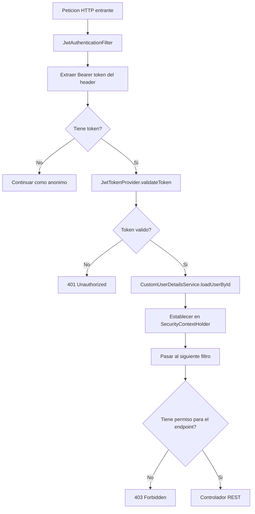

# DC-04: Seguridad y Autenticacion

Diagrama de clases del subsistema de seguridad. Muestra como `SecurityConfiguration`, `JwtAuthenticationFilter`, `JwtTokenProvider`, `CustomUserDetailsService` y `UserPrincipal` colaboran para autenticar cada peticion HTTP y adaptar la entidad `User` del dominio al modelo de Spring Security.

## Diagrama de Clases (PlantUML)

## Diagrama de Clases (Mermaid)

---

## Componentes del Subsistema de Seguridad

### SecurityConfiguration

Clase de configuracion central de Spring Security (anotada con `@EnableWebSecurity`).

Responsabilidades:
- Define la cadena de filtros de seguridad (`SecurityFilterChain`)
- Establece reglas de autorizacion por endpoint segun el rol requerido
- Configura el manejo de sesiones como **stateless** (sin estado HTTP en servidor)
- Expone el bean `PasswordEncoder` con BCrypt
- Registra `JwtAuthenticationFilter` en la cadena de filtros

**Reglas de acceso configuradas:**

| Patron de URL | Roles permitidos |
|---|---|
| `POST /api/auth/**` | Publico (sin autenticacion) |
| `GET /api/votes/verify/**` | Publico |
| `GET /api/elections/active` | Publico |
| `POST /api/votes` | VOTER |
| `POST /api/elections/**` | ADMIN |
| `GET /api/elections/{id}/results` | ADMIN, SUPERVISOR |
| `GET /api/statistics/**` | ADMIN, SUPERVISOR |
| `GET /api/audit/**` | ADMIN, AUDITOR |

### JwtAuthenticationFilter

Filtro personalizado que extiende `OncePerRequestFilter`. Se ejecuta exactamente una vez por cada peticion HTTP.

Flujo de ejecucion:
1. Extrae el token del header `Authorization: Bearer <token>`
2. Llama a `JwtTokenProvider.validateToken(token)` para verificar firma y expiracion
3. Si es valido, extrae el `userId` del token
4. Llama a `CustomUserDetailsService.loadUserById(userId)`
5. Crea un `UsernamePasswordAuthenticationToken` y lo establece en `SecurityContextHolder`
6. Pasa la peticion al siguiente filtro

### JwtTokenProvider

Componente utilitario para operaciones sobre tokens JWT.

| Metodo | Descripcion |
|---|---|
| `createToken(authentication)` | Genera JWT firmado con HMAC-SHA256, incluye userId, username, role, iat y exp |
| `getUserIdFromJWT(token)` | Extrae el claim `sub` (userId) del token |
| `validateToken(token)` | Verifica firma y que no este expirado; retorna `false` para tokens en blacklist Redis |

**Configuracion de tokens:**

| Token | Duracion | Uso |
|---|---|---|
| Access Token | 8 horas | Autenticar peticiones a la API |
| Refresh Token | 7 dias | Renovar el access token sin re-login |

### CustomUserDetailsService

Implementa la interfaz estandar de Spring Security `UserDetailsService`. Su unica responsabilidad es cargar datos del usuario desde PostgreSQL y adaptarlos al modelo de seguridad.

- `loadUserByUsername(usernameOrEmail)` - usado en el flujo de login inicial
- `loadUserById(id)` - usado en `JwtAuthenticationFilter` para validar tokens en peticiones subsiguientes

### UserPrincipal

Implementa `UserDetails` de Spring Security. Es un adaptador (patron Adapter) que convierte la entidad de dominio `User` en el objeto que Spring Security entiende.

Implementa los metodos de estado de cuenta basandose en el campo `active` de la entidad `User`:
- `isEnabled()` - retorna `user.isActive()`
- `isAccountNonLocked()` - retorna `user.isActive()`
- `isCredentialsNonExpired()` - retorna `true`
- `isAccountNonExpired()` - retorna `true`

## Flujo de Autenticacion en Cada Peticion

