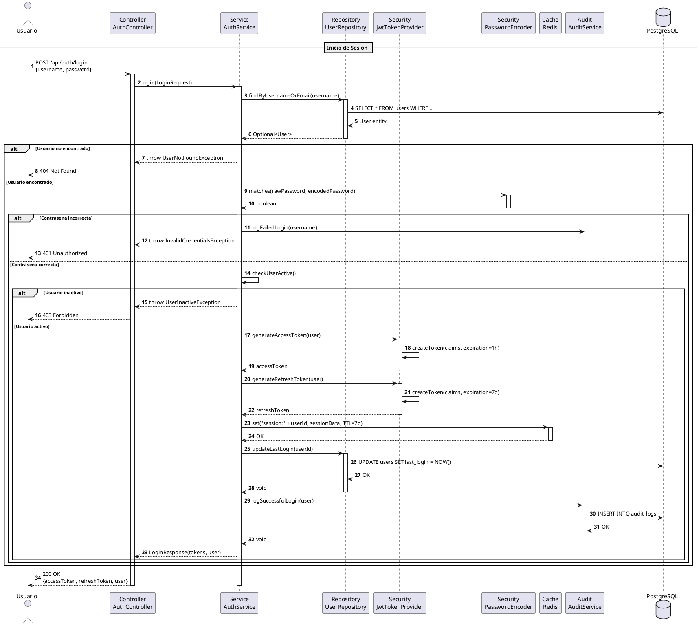
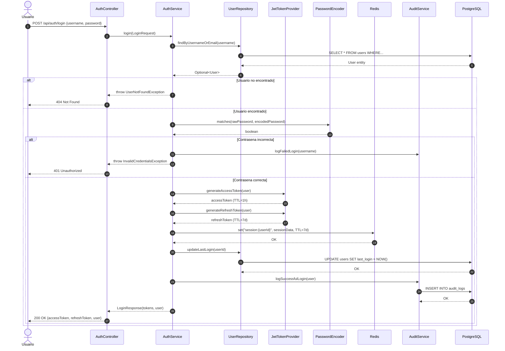

# DS-01: Autenticacion JWT

Flujo completo de inicio de sesion, incluyendo validacion de credenciales con BCrypt, generacion de tokens JWT de acceso (1h) y refresco (7d), almacenamiento de sesion en Redis y registro de auditoria.

## Diagrama de Secuencia (PlantUML)



## Diagrama de Secuencia (Mermaid)



---

## Actores y Componentes

| Componente | Responsabilidad |
|---|---|
| AuthController | Controlador REST que recibe la peticion HTTP |
| AuthService | Orquesta la logica de autenticacion |
| UserRepository | Acceso a datos de usuarios en PostgreSQL |
| JwtTokenProvider | Genera y valida tokens JWT (HS256) |
| PasswordEncoder | Verifica contrasenas con BCrypt (factor 12) |
| Redis | Cache de sesiones con TTL |
| AuditService | Registra todos los eventos de autenticacion |

## Pasos del Flujo

1. El usuario envia username y password al endpoint `POST /api/auth/login`
2. El servicio busca el usuario por username o email en PostgreSQL
3. Si no existe, se retorna `404 Not Found`
4. Se compara la contrasena enviada contra el hash BCrypt almacenado
5. Si falla, se audita el intento fallido y se retorna `401 Unauthorized`
6. Se verifica que el usuario este en estado activo (`active = true`)
7. Se genera el **access token** JWT con expiracion de 1 hora
8. Se genera el **refresh token** JWT con expiracion de 7 dias
9. Se almacena la sesion en Redis con clave `session:{userId}` y TTL de 7 dias
10. Se actualiza `last_login` en la base de datos
11. Se registra el login exitoso en `audit_logs`
12. Se retornan los tokens y datos basicos del usuario

## Estructura de Claims JWT

```json
{
  "sub": "userId",
  "username": "string",
  "role": "VOTER|ADMIN|SUPERVISOR",
  "iat": "timestamp",
  "exp": "timestamp"
}
```

## Estructura de Sesion en Redis

```json
{
  "userId": 1,
  "username": "string",
  "role": "VOTER",
  "loginTime": "2025-11-01T08:00:00",
  "lastActivity": "2025-11-01T08:00:00"
}
```

## Consideraciones de Seguridad

- Las contrasenas se almacenan con BCrypt factor 12
- Los tokens JWT estan firmados con HMAC-SHA256
- Las sesiones tienen TTL automatico en Redis
- Los intentos de login fallidos quedan auditados en PostgreSQL
- Rate limiting aplicado en el controller para prevenir fuerza bruta
