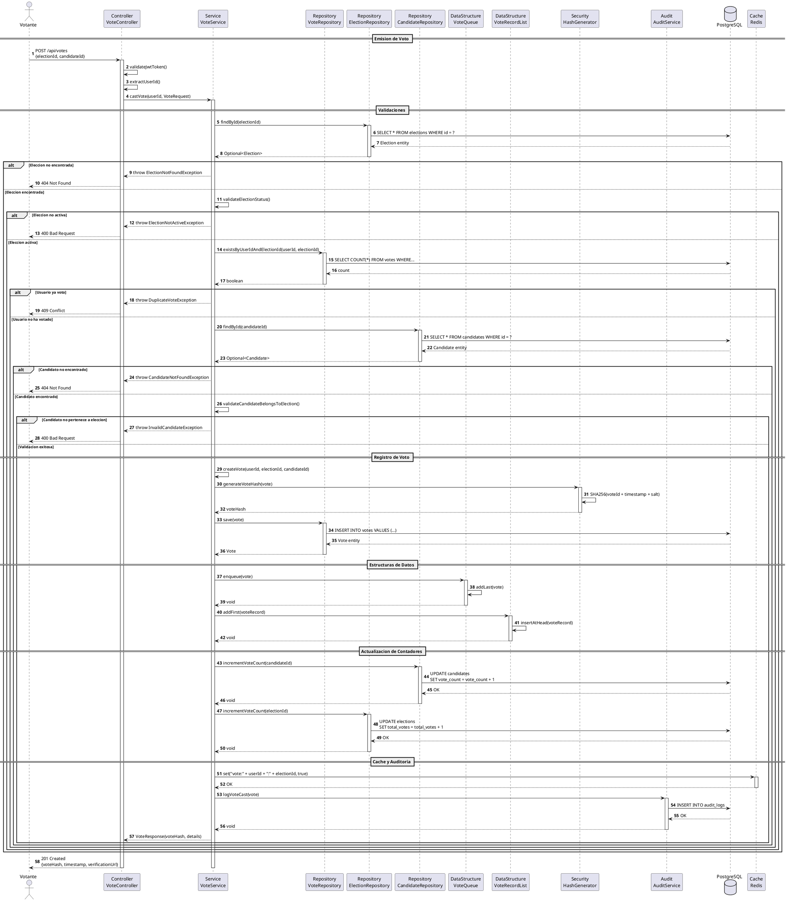
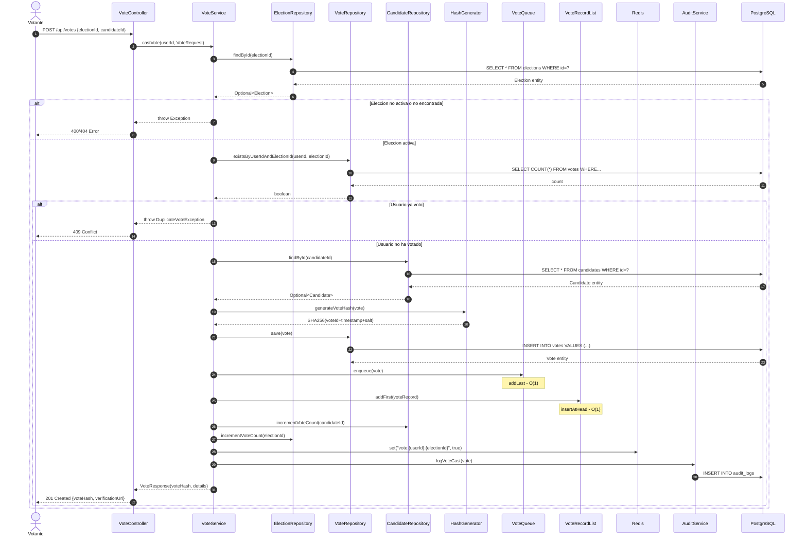

# DS-02: Emision de Voto

Flujo completo de emision de voto: validaciones de elegibilidad, generacion del hash SHA-256, insercion en las estructuras de datos personalizadas (`VoteQueue`, `VoteRecordList`), actualizacion de contadores y registro de auditoria.

## Diagrama de Secuencia (PlantUML)

## Diagrama de Secuencia (Mermaid)

---

## Actores y Componentes

| Componente | Responsabilidad |
|---|---|
| VoteController | Recibe la peticion, valida el JWT, extrae el userId |
| VoteService | Orquesta todas las validaciones y el registro del voto |
| ElectionRepository | Verifica existencia y estado de la eleccion |
| VoteRepository | Guarda el voto y verifica duplicados |
| CandidateRepository | Valida candidato e incrementa contadores |
| HashGenerator | Genera el hash SHA-256 del voto |
| VoteQueue | Cola FIFO para procesamiento ordenado de votos |
| VoteRecordList | Lista enlazada para historial cronologico inverso |
| Redis | Marca que el usuario ya voto (previene duplicados rapidos) |
| AuditService | Registra el evento de voto |

## Pasos del Flujo

1. El votante envia `POST /api/votes` con `{ electionId, candidateId }`
2. El controller valida el JWT y extrae el `userId`
3. Se verifica que la eleccion exista y este en estado `ACTIVE`
4. Se verifica que el usuario no haya votado ya en esa eleccion (tabla `votes`)
5. Se verifica que el candidato exista y pertenezca a esa eleccion
6. Se crea el objeto `Vote` con timestamp e IP del cliente
7. Se genera el hash SHA-256: `SHA256(voteId + timestamp + salt)`
8. Se persiste el voto en PostgreSQL
9. Se encola el voto en `VoteQueue` - operacion O(1)
10. Se inserta el registro en `VoteRecordList` al inicio - operacion O(1)
11. Se incrementa `vote_count` del candidato y `total_votes` de la eleccion
12. Se marca en Redis: `vote:{userId}:{electionId} = true`
13. Se registra el evento en `audit_logs`
14. Se retorna el recibo con el hash de verificacion

## Estructuras de Datos Utilizadas

| Estructura | Operacion | Complejidad | Proposito |
|---|---|---|---|
| VoteQueue | `enqueue(vote)` | O(1) | Procesamiento FIFO de votos |
| VoteRecordList | `addFirst(voteRecord)` | O(1) | Historial cronologico inverso |

## Reglas de Negocio Aplicadas

| ID | Regla |
|---|---|
| RN-11 | Un usuario solo puede votar una vez por eleccion |
| RN-12 | El voto es anonimo - no se almacena relacion directa usuario-candidato |
| RN-13 | El hash permite verificacion sin revelar identidad |
| RN-14 | Los votos se procesan en orden FIFO mediante VoteQueue |
| RN-15 | Todos los votos deben ser auditados |
