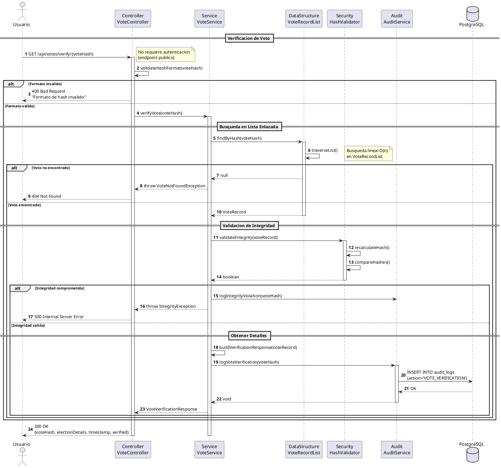
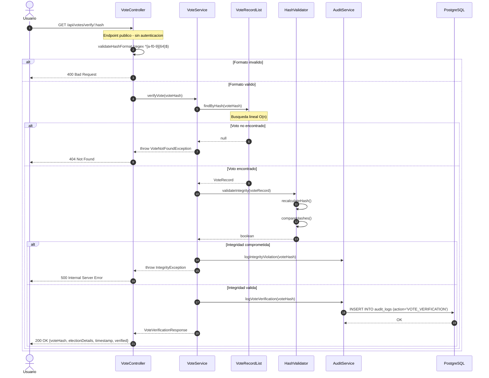

# DS-03: Verificacion de Voto

Flujo del endpoint publico de verificacion de voto. No requiere autenticacion. Realiza una busqueda lineal en `VoteRecordList` y valida la integridad del hash recalculando `SHA256(voteId + timestamp + electionId + salt)`.

## Diagrama de Secuencia (PlantUML)



## Diagrama de Secuencia (Mermaid)



---

## Actores y Componentes

| Componente | Responsabilidad |
|---|---|
| VoteController | Valida el formato del hash antes de pasar al servicio |
| VoteService | Orquesta la busqueda y validacion de integridad |
| VoteRecordList | Lista enlazada donde se busca el voto por hash - O(n) |
| HashValidator | Recalcula el hash y compara con el almacenado |
| AuditService | Registra todas las consultas de verificacion |

## Pasos del Flujo

1. El usuario (anonimo) accede a `GET /api/votes/verify/{voteHash}`
2. El controller valida el formato del hash con el patron `^[a-f0-9]{64}$`
3. Si el formato es invalido, se retorna `400 Bad Request` de inmediato
4. El servicio busca el voto en `VoteRecordList` con recorrido lineal O(n)
5. Si no se encuentra, se retorna `404 Not Found`
6. El validador recalcula el hash: `SHA256(voteId + timestamp + electionId + salt)`
7. Si el hash recalculado no coincide con el almacenado, se registra una violacion de integridad y se retorna `500 Internal Server Error`
8. Si la integridad es valida, se registra la verificacion en auditoria
9. Se retorna la respuesta con los detalles del voto sin revelar la identidad del votante

## Estructura de Datos: VoteRecordList

```
[Head] -> [VoteRecord hash=abc] -> [VoteRecord hash=def] -> [VoteRecord hash=ghi] -> null
```

- **Operacion**: `findByHash(hash)` - O(n) recorrido secuencial desde head
- La busqueda lineal es aceptable dado que la verificacion no es una operacion de alto volumen
- Los nodos se insertan al inicio (`addFirst`) al momento de emitir el voto

## Validacion de Integridad

El hash se recalcula en el servidor con la misma formula original:

```
SHA256(voteId + timestamp + electionId + salt)
```

Si el hash recalculado coincide con el almacenado, el voto es integro e inmutable. Cualquier modificacion del registro en base de datos rompe la integridad.

## Reglas de Negocio Aplicadas

| ID | Regla |
|---|---|
| RN-19 | La verificacion es publica - no requiere autenticacion |
| RN-20 | El hash es unico e inmutable |
| RN-21 | La verificacion no debe revelar la identidad del votante |
| RN-22 | Todas las verificaciones deben ser auditadas |

## Consideraciones de Privacidad

La respuesta solo incluye:
- El hash del voto
- La eleccion donde se emitio (nombre e ID)
- El timestamp de emision
- El estado de verificacion (`verified: true`)

No se expone ningun dato que identifique al votante ni el candidato por quien voto.
