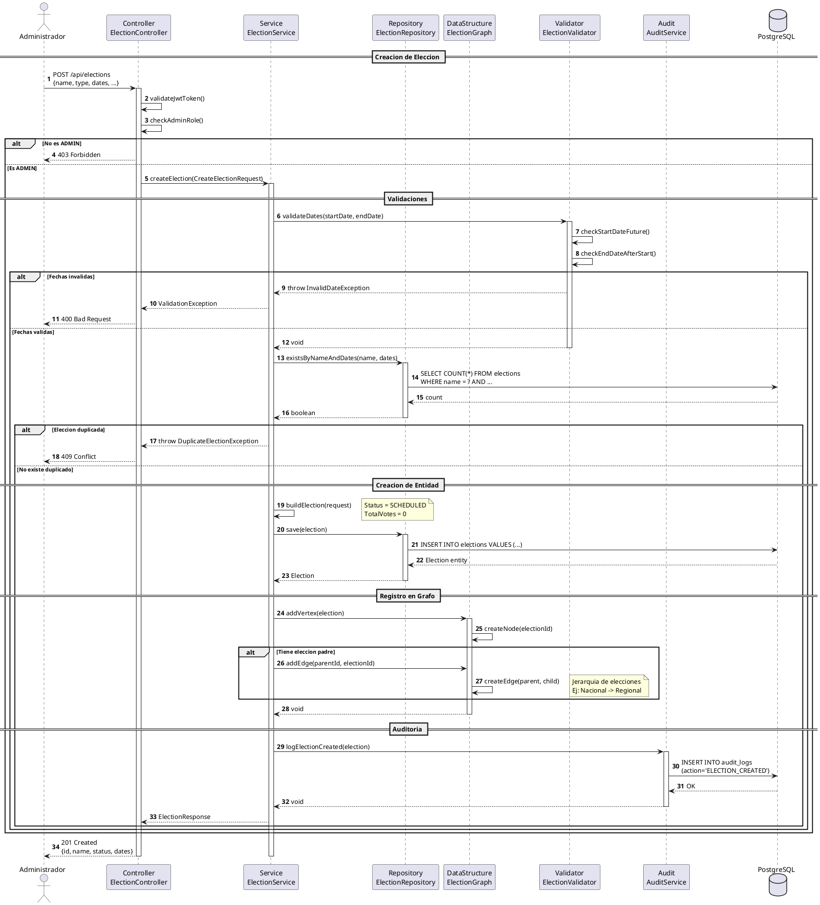
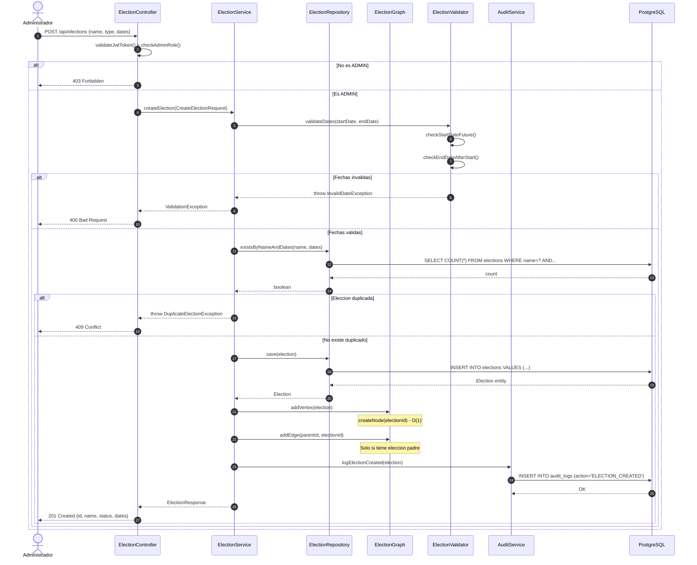

# DS-04: Creacion de Eleccion

Flujo de creacion de una eleccion por un Administrador. Incluye validacion de fechas, verificacion de duplicados, persistencia en PostgreSQL, registro en el `ElectionGraph` para modelar jerarquias y auditoria.

## Diagrama de Secuencia (PlantUML)



## Diagrama de Secuencia (Mermaid)



---

## Actores y Componentes

| Componente | Responsabilidad |
|---|---|
| ElectionController | Verifica JWT y rol ADMIN antes de delegar |
| ElectionService | Orquesta validaciones, persistencia y grafo |
| ElectionRepository | Guarda la eleccion y verifica duplicados |
| ElectionGraph | Grafo dirigido para jerarquias de elecciones |
| ElectionValidator | Valida coherencia temporal de fechas |
| AuditService | Registra el evento de creacion |

## Pasos del Flujo

1. El administrador envia `POST /api/elections` con los datos de la eleccion
2. El controller valida el JWT y verifica el rol ADMIN
3. El validador comprueba que `startDate > NOW()` y `endDate > startDate`
4. Se verifica que no exista una eleccion con el mismo nombre en el mismo periodo
5. Se construye la entidad `Election` con estado inicial `SCHEDULED` y `totalVotes = 0`
6. Se persiste en PostgreSQL
7. Se registra un vertice en `ElectionGraph` para la nueva eleccion
8. Si la eleccion tiene una eleccion padre (jerarquia), se crea una arista dirigida `(parent -> child)`
9. Se registra el evento en `audit_logs`
10. Se retorna la eleccion creada con `201 Created`

## Estructura de Datos: ElectionGraph

El `ElectionGraph` es un grafo dirigido que modela jerarquias entre elecciones:

```
         [Eleccion Nacional]
                |
        +-------+-------+
        |               |
   [Regional A]    [Regional B]
        |               |
    +---+---+       +---+---+
    |       |       |       |
 [Local1][Local2][Local3][Local4]
```

| Operacion | Complejidad | Descripcion |
|---|---|---|
| `addVertex(election)` | O(1) | Agrega un nodo al grafo |
| `addEdge(parent, child)` | O(1) | Crea relacion jerarquica |
| `getChildren(electionId)` | O(V+E) | Obtiene elecciones hijas |

## Validaciones de Fechas

- `startDate` debe ser posterior a la fecha actual
- `endDate` debe ser posterior a `startDate`
- Duracion minima: 1 hora
- Duracion maxima: 30 dias
- No se permite solapamiento de fechas para el mismo tipo y distrito

## Reglas de Negocio Aplicadas

| ID | Regla |
|---|---|
| RN-24 | La fecha de inicio debe ser posterior a la fecha actual |
| RN-25 | La fecha de fin debe ser posterior a la fecha de inicio |
| RN-26 | El nombre de la eleccion debe ser unico para el mismo periodo |
| RN-27 | Las elecciones se organizan en jerarquias mediante ElectionGraph |
