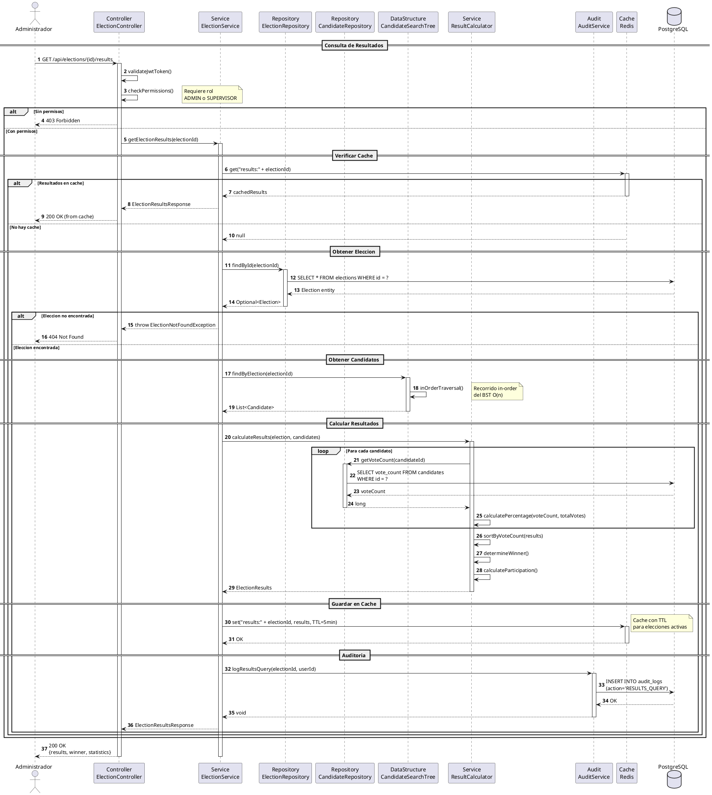
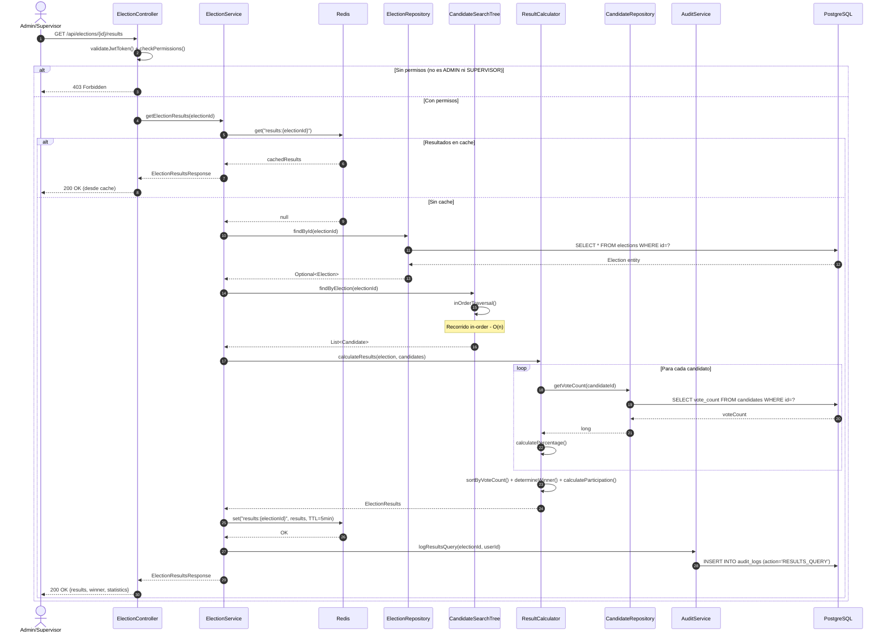

# DS-05: Consulta de Resultados

Flujo de consulta de resultados electorales para roles ADMIN y SUPERVISOR. Implementa una estrategia cache-first con Redis (TTL de 5 minutos para elecciones activas, 24 horas para cerradas). Cuando no hay cache, obtiene los candidatos via `CandidateSearchTree.inOrderTraversal()` y calcula porcentajes y ganador.

## Diagrama de Secuencia (PlantUML)



## Diagrama de Secuencia (Mermaid)



---

## Actores y Componentes

| Componente | Responsabilidad |
|---|---|
| ElectionController | Verifica JWT y permisos ADMIN/SUPERVISOR |
| ElectionService | Orquesta la consulta con estrategia cache-first |
| Redis | Cache de resultados con TTL variable |
| ElectionRepository | Obtiene datos de la eleccion |
| CandidateSearchTree | Proporciona candidatos via inOrderTraversal() |
| ResultCalculator | Calcula porcentajes, ganador y tasa de participacion |
| CandidateRepository | Obtiene el conteo de votos por candidato |
| AuditService | Registra todas las consultas de resultados |

## Pasos del Flujo

1. El admin/supervisor consulta `GET /api/elections/{id}/results`
2. El controller valida el JWT y verifica que el rol sea ADMIN o SUPERVISOR
3. El servicio consulta Redis con la clave `results:{electionId}`
4. Si hay cache, se retorna directamente (respuesta rapida)
5. Si no hay cache, se busca la eleccion en PostgreSQL
6. Se obtienen los candidatos via `CandidateSearchTree.inOrderTraversal()` - O(n)
7. Para cada candidato, se obtiene su `vote_count` de la base de datos
8. Se calculan los porcentajes: `(voteCount / totalVotes) * 100`
9. Se ordenan los resultados por votos de forma descendente
10. Se determina el ganador (candidato con mas votos)
11. Se calcula la tasa de participacion: `(totalVotes / eligibleVoters) * 100`
12. Se guardan los resultados en Redis con TTL segun el estado de la eleccion
13. Se registra la consulta en `audit_logs`
14. Se retornan los resultados completos

## Estructura de Datos: CandidateSearchTree

```
           [Candidato C]
          /             \
    [Candidato A]    [Candidato E]
         \               /
      [Candidato B] [Candidato D]
```

- **Operacion**: `inOrderTraversal()` - O(n), retorna candidatos en orden
- El BST permite busqueda individual en O(log n) para candidatos especificos

## Estrategia de Cache

| Tipo de eleccion | TTL | Clave Redis |
|---|---|---|
| Activa | 5 minutos | `results:{electionId}` |
| Cerrada | 24 horas | `results:{electionId}` |
| Estadisticas sistema | 10 minutos | `stats:system` |

La cache se invalida automaticamente cuando se registra un nuevo voto en la eleccion.

## Metricas Calculadas

```
percentage = (voteCount / totalVotes) * 100
participationRate = (totalVotes / eligibleVoters) * 100
winner = candidate with max(voteCount)
```

## Reglas de Negocio Aplicadas

| ID | Regla |
|---|---|
| RN-39 | Solo ADMIN y SUPERVISOR pueden consultar resultados |
| RN-40 | Los resultados se ordenan por cantidad de votos (descendente) |
| RN-41 | El ganador es el candidato con mas votos |
| RN-42 | Todas las consultas de resultados deben ser auditadas |
