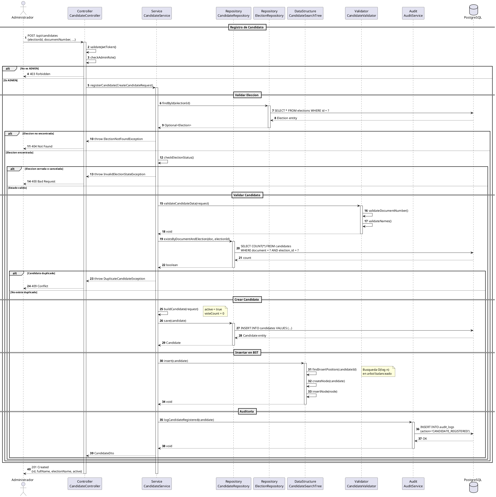
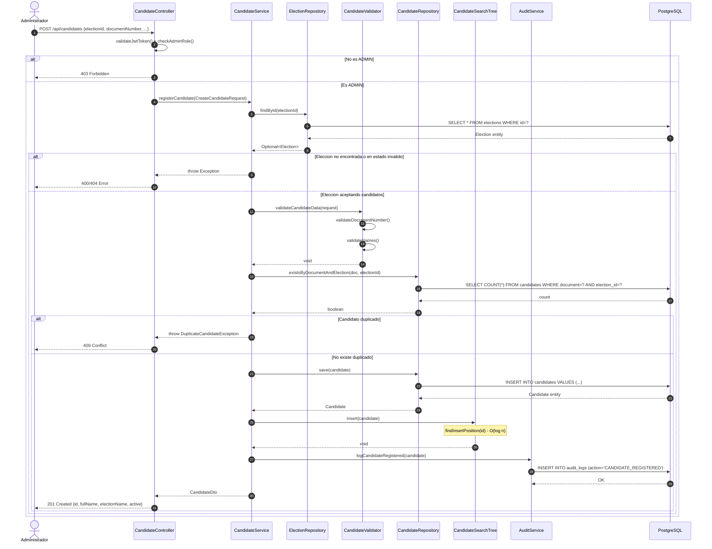

# DS-06: Registro de Candidato

Flujo de registro de un candidato por un Administrador. Valida el estado de la eleccion, los datos del candidato, verifica duplicados por documento en la misma eleccion, persiste en PostgreSQL e inserta el candidato en `CandidateSearchTree` con complejidad O(log n).

## Diagrama de Secuencia (PlantUML)



## Diagrama de Secuencia (Mermaid)



---

## Actores y Componentes

| Componente | Responsabilidad |
|---|---|
| CandidateController | Verifica JWT y rol ADMIN |
| CandidateService | Orquesta validaciones y creacion del candidato |
| ElectionRepository | Verifica existencia y estado de la eleccion |
| CandidateValidator | Valida formato de documento y nombres |
| CandidateRepository | Guarda el candidato y verifica duplicados |
| CandidateSearchTree | BST donde se inserta el candidato para busqueda eficiente |
| AuditService | Registra el evento de registro |

## Pasos del Flujo

1. El administrador envia `POST /api/candidates` con los datos del candidato
2. El controller valida el JWT y verifica el rol ADMIN
3. Se verifica que la eleccion exista en PostgreSQL
4. Se verifica que la eleccion no este en estado `CLOSED` o `CANCELLED`
5. El validador comprueba el formato del numero de documento y los nombres
6. Se verifica que no exista otro candidato con el mismo documento en la misma eleccion
7. Se construye la entidad `Candidate` con `active = true` y `voteCount = 0`
8. Se persiste el candidato en PostgreSQL
9. Se inserta el candidato en `CandidateSearchTree` con operacion O(log n)
10. Se registra el evento en `audit_logs`
11. Se retorna el candidato creado con `201 Created`

## Estructura de Datos: CandidateSearchTree

Insercion de candidatos ordenados por ID:

```
Antes de insertar ID=4:    Despues de insertar ID=4:
        [5]                        [5]
       /   \                      /   \
     [3]   [7]                  [3]   [7]
                                   \
                                   [4]
```

| Operacion | Complejidad promedio | Complejidad peor caso |
|---|---|---|
| `insert(candidate)` | O(log n) | O(n) arbol degenerado |
| `findById(id)` | O(log n) | O(n) |
| `inOrderTraversal()` | O(n) | O(n) |
| `delete(id)` | O(log n) | O(n) |

## Validaciones Aplicadas

**Numero de documento:**
- Formato valido segun tipo (DNI, CE, etc.)
- Longitud correcta
- Solo digitos

**Nombres:**
- No vacios
- Longitud minima: 2 caracteres
- Solo letras y espacios

## Reglas de Negocio Aplicadas

| ID | Regla |
|---|---|
| RN-33 | Un candidato no puede estar registrado dos veces en la misma eleccion |
| RN-34 | Los candidatos se organizan en BST para busqueda eficiente O(log n) |
| RN-35 | No se pueden agregar candidatos a elecciones cerradas o canceladas |
| RN-36 | El numero de candidato debe ser unico por eleccion |
