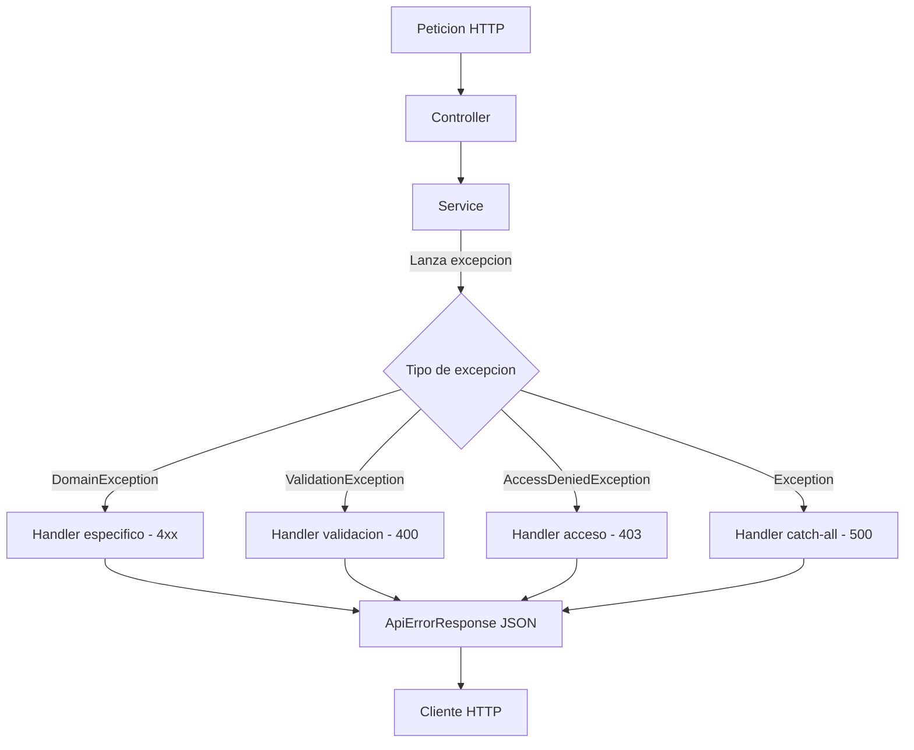

# Manejo de Errores

Todos los errores del sistema pasan por un `GlobalExceptionHandler` centralizado (`@RestControllerAdvice`) que los convierte en respuestas JSON estandarizadas. El frontend los procesa via `errorInterceptor`.

## Formato de respuesta de error

Todas las respuestas de error siguen la misma estructura:

```json
{
  "success": false,
  "message": "Descripcion del error",
  "error": "CODIGO_DE_ERROR",
  "timestamp": "2025-11-01T10:30:00",
  "path": "/api/votes"
}
```

| Campo | Tipo | Descripcion |
|---|---|---|
| `success` | boolean | Siempre `false` en errores |
| `message` | string | Mensaje legible para mostrar al usuario |
| `error` | string | Codigo interno del error |
| `timestamp` | string | Fecha y hora del error (ISO 8601) |
| `path` | string | Endpoint que genero el error |

---

## Catalogo de excepciones

### Excepciones de dominio personalizadas

Todas residen en `pe.com.mivoto.service.domain.exceptions`.

| Excepcion | HTTP | Descripcion | Cuando se lanza |
|---|---|---|---|
| `AuthenticationException` | 401 Unauthorized | Credenciales invalidas o token expirado | Login fallido, token invalido |
| `UserNotFoundException` | 404 Not Found | El usuario solicitado no existe | Busqueda por ID o username inexistente |
| `ElectionNotFoundException` | 404 Not Found | La eleccion solicitada no existe | Busqueda por ID de eleccion inexistente |
| `DuplicateVoteException` | 409 Conflict | El usuario ya voto en esta eleccion | Intento de voto duplicado |
| `InvalidElectionException` | 400 Bad Request | La eleccion no esta en el estado requerido | Votar en eleccion no activa, iniciar eleccion sin candidatos |
| `VotingException` | 400 Bad Request | Error generico en el proceso de votacion | Candidato no pertenece a la eleccion, candidato inactivo |

### Excepciones de framework manejadas

El `GlobalExceptionHandler` tambien captura excepciones de Spring y Java:

| Excepcion | HTTP | Descripcion |
|---|---|---|
| `MethodArgumentNotValidException` | 400 Bad Request | Fallo de validacion en campos del request (`@Valid`) |
| `AccessDeniedException` | 403 Forbidden | El usuario no tiene el rol requerido |
| `IllegalArgumentException` | 400 Bad Request | Argumento invalido en la logica de negocio |
| `IllegalStateException` | 409 Conflict | Estado invalido del sistema (p. ej. concurrencia) |
| `NoResourceFoundException` | 404 Not Found | Endpoint no existe |
| `Exception` (catch-all) | 500 Internal Server Error | Error inesperado del servidor |

---

## Ejemplos de respuestas de error

### 400 - Request invalido

Ocurre cuando un campo falla la validacion de `@Valid`:

```json
{
  "success": false,
  "message": "Error de validacion en los campos enviados",
  "error": "VALIDATION_ERROR",
  "errors": {
    "electionId": "No puede ser nulo",
    "candidateId": "Debe ser un numero positivo"
  },
  "timestamp": "2025-11-01T10:30:00",
  "path": "/api/votes"
}
```

### 401 - No autenticado

```json
{
  "success": false,
  "message": "Token JWT invalido o expirado",
  "error": "AUTHENTICATION_ERROR",
  "timestamp": "2025-11-01T10:30:00",
  "path": "/api/elections"
}
```

### 403 - Sin permisos

```json
{
  "success": false,
  "message": "No tienes permisos para realizar esta accion",
  "error": "ACCESS_DENIED",
  "timestamp": "2025-11-01T10:30:00",
  "path": "/api/elections/1/results"
}
```

### 404 - Recurso no encontrado

```json
{
  "success": false,
  "message": "La eleccion con ID 99 no fue encontrada",
  "error": "ELECTION_NOT_FOUND",
  "timestamp": "2025-11-01T10:30:00",
  "path": "/api/elections/99"
}
```

### 409 - Conflicto

```json
{
  "success": false,
  "message": "Ya has emitido tu voto en esta eleccion",
  "error": "DUPLICATE_VOTE",
  "timestamp": "2025-11-01T10:30:00",
  "path": "/api/votes"
}
```

### 500 - Error interno

```json
{
  "success": false,
  "message": "Ha ocurrido un error interno. Por favor intentalo mas tarde.",
  "error": "INTERNAL_ERROR",
  "timestamp": "2025-11-01T10:30:00",
  "path": "/api/votes/verify/abc123"
}
```

---

## GlobalExceptionHandler

Clase central ubicada en `pe.com.mivoto.service.presentation.exception.GlobalExceptionHandler`. Anotada con `@RestControllerAdvice` para interceptar excepciones de todos los controllers.



El handler construye siempre un objeto `ApiErrorResponse` con los campos estandarizados antes de serializar la respuesta.

---

## Manejo de errores en el frontend

El `errorInterceptor` de Angular intercepta todas las respuestas de error HTTP y las transforma en mensajes de usuario antes de propagarlas:

| Codigo HTTP | Accion del interceptor |
|---|---|
| 400 | Muestra el mensaje de validacion del campo `message` |
| 401 | Limpia la sesion y redirige a `/auth/login` |
| 403 | Redirige a pagina de acceso denegado |
| 404 | Muestra notificacion de recurso no encontrado |
| 409 | Muestra mensaje de conflicto (voto duplicado, etc.) |
| 500 | Muestra mensaje generico de error del servidor |
| Sin conexion | Muestra mensaje de red no disponible |

---

## Seguridad en el manejo de errores

- Los errores `500` nunca exponen stack traces ni detalles internos en produccion
- Los errores de integridad de voto (`hash comprometido`) se registran en `audit_logs` antes de responder
- Los intentos de login fallidos se registran en auditoria pero no revelan si el usuario existe o no (mensaje generico)
- El `path` se omite en respuestas de produccion para no exponer la estructura de URLs internas
