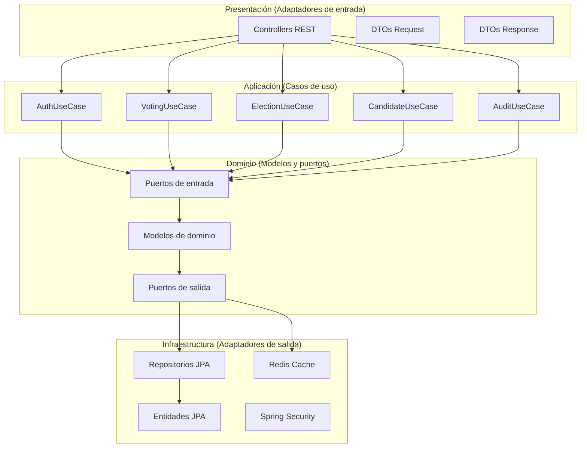

# Backend- Visión General

El backend de MiVoto está construido con **Spring Boot 3.2.1** y **Java 17**. Sigue una **arquitectura hexagonal (Puertos y Adaptadores)** con capas bien definidas.

## Stack Tecnológico

| Tecnología | Versión | Uso |
|---|---|---|
| Java | 17 | Lenguaje principal |
| Spring Boot | 3.2.1 | Framework base |
| Spring Security | 6.x | Autenticación y autorización |
| Spring Data JPA | 3.2.x | Persistencia ORM |
| JJWT | 0.12.3 | Generación y validación de JWT |
| PostgreSQL |- | Base de datos principal |
| H2 |- | Base de datos en memoria (testing) |
| Redis |- | Caché de elecciones |
| Flyway | 11.20.2 | Migraciones de base de datos |
| MapStruct | 1.5.5 | Mapeo entre capas |
| Lombok | 1.18.30 | Reducción de boilerplate |
| SpringDoc OpenAPI | 2.3.0 | Documentación Swagger |

## Arquitectura Hexagonal



## Estructura de Paquetes

```
pe.com.mivoto.service
├── presentation/
│   ├── controllers/       - 8 controladores REST
│   ├── dto/request/       - DTOs de entrada
│   ├── dto/response/      - DTOs de salida
│   └── mappers/           - Mappers DTO ↔ Dominio
│
├── application/
│   ├── usecases/          - Implementaciones de casos de uso
│   │   ├── auth/
│   │   ├── voting/
│   │   ├── election/
│   │   ├── audit/
│   │   └── user/
│   └── services/          - Servicios de aplicación
│
├── domain/
│   ├── model/             - Objetos de dominio
│   ├── enums/             - Enumeraciones de negocio
│   ├── exceptions/        - Excepciones de dominio
│   └── ports/
│       ├── in/            - Puertos de entrada (interfaces)
│       └── out/           - Puertos de salida (interfaces)
│
├── infrastructure/
│   ├── config/            - Configuración de beans
│   ├── security/jwt/      - Filtros y proveedor JWT
│   ├── persistence/       - Entidades JPA y repositorios
│   └── exception/handlers/- Manejo global de errores
│
└── datastructures/        - Estructuras de datos personalizadas
    ├── linear/            - Queue, Stack, LinkedList
    └── nonlinear/         - Tree, Graph
```

## Controladores REST

| Controlador | Ruta Base | Descripción |
|---|---|---|
| `AuthController` | `/api/auth` | Login, logout, refresh token |
| `VotingController` | `/api/votes` | Emisión y verificación de votos |
| `ElectionController` | `/api/elections` | CRUD y ciclo de vida de elecciones |
| `CandidateController` | `/api/candidates` | Gestión de candidatos |
| `AuditController` | `/api/audit` | Consulta de logs de auditoría |
| `StatisticsController` | `/api/statistics` | Estadísticas del sistema y elecciones |
| `UserController` | `/api/users` | Gestión de usuarios |
| `HealthController` | `/api/health` | Estado del sistema |

## Procesamiento Asíncrono

El backend utiliza un `ThreadPoolTaskExecutor` configurado para operaciones en segundo plano (auditoría, notificaciones, procesamiento de colas de votos).

## Caché con Redis

Las siguientes respuestas son cacheadas en Redis con un TTL de 10 minutos:
- Lista de todas las elecciones
- Elecciones activas
- Detalles de elección individual

El caché se invalida automáticamente cuando una elección cambia de estado.
