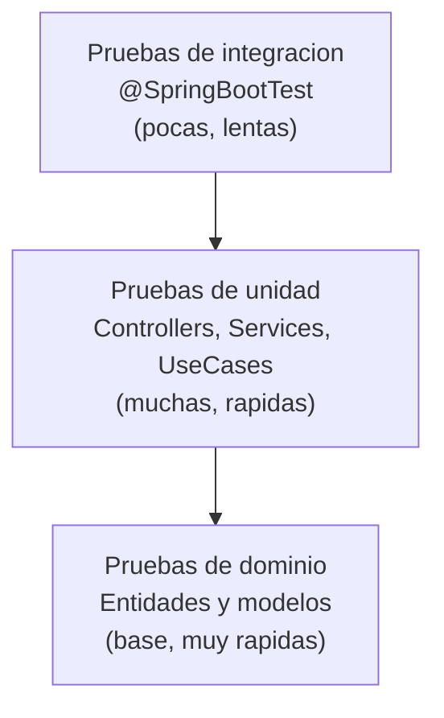

# Estrategia de Pruebas

MiVoto implementa una estrategia de pruebas en capas con JUnit 5 y Mockito en el backend, y Karma + Jasmine en el frontend. La cobertura se mide con JaCoCo y el analisis de calidad con SonarQube.

## Piramide de pruebas



| Capa | Anotacion | Base de datos | Cantidad |
|---|---|---|---|
| Integracion | `@SpringBootTest` | H2 en memoria | Pocas |
| Controladores | `@ExtendWith(MockitoExtension)` | Mocks | Media |
| Servicios y casos de uso | `@ExtendWith(MockitoExtension)` | Mocks | Media |
| Modelos de dominio | JUnit 5 puro | Ninguna | Muchas |

---

## Herramientas

| Herramienta | Version | Uso |
|---|---|---|
| JUnit 5 (Jupiter) | 5.x (via Spring Boot) | Framework de pruebas |
| Mockito | 5.x (via Spring Boot) | Mocks y stubs |
| Spring Boot Test | 3.2.1 | Contexto de integracion |
| H2 Database | Runtime test | Base de datos en memoria para tests |
| JaCoCo | 0.8.11 | Reporte de cobertura de codigo |
| SonarQube Scanner | - | Analisis estatico de calidad |

---

## Clases de prueba del backend

### Prueba de integracion principal

| Clase | Tipo | Descripcion |
|---|---|---|
| `MivotoServiceMonoApplicationTests` | `@SpringBootTest` | Verifica que el contexto de Spring levanta correctamente |

Usa `@ActiveProfiles("test")` y H2 como base de datos para no depender de PostgreSQL.

### Pruebas de controladores

| Clase | Capa | Descripcion |
|---|---|---|
| `AuthControllerTest` | Presentacion | Login, refresh token, logout |
| `ElectionControllerTest` | Presentacion | CRUD de elecciones, cambios de estado |
| `VotingControllerTest` | Presentacion | Emision de voto, verificacion, historial |

Patron usado:

```java
@ExtendWith(MockitoExtension.class)
class VotingControllerTest {

    @Mock
    private VoteUseCase voteUseCase;

    @InjectMocks
    private VoteController voteController;

    @Test
    @DisplayName("Debe retornar 201 al emitir un voto valido")
    void castVote_validRequest_returns201() {
        // given
        when(voteUseCase.castVote(any())).thenReturn(mockResponse());

        // when
        ResponseEntity<?> response = voteController.castVote(validRequest());

        // then
        assertThat(response.getStatusCode()).isEqualTo(HttpStatus.CREATED);
    }
}
```

### Pruebas de casos de uso

| Clase | Descripcion |
|---|---|
| `AuthUseCasesTest` | Login, validacion de credenciales, generacion de tokens |
| `VotingUseCasesTest` | Flujo completo de voto, deteccion de duplicados |
| `ElectionUseCasesTest` | Creacion, inicio, cierre y cancelacion de elecciones |
| `AuditUseCasesTest` | Registro de eventos de auditoria |
| `GetUserProfileUseCaseImplTest` | Consulta de perfil de usuario |

### Pruebas de servicios

| Clase | Descripcion |
|---|---|
| `CandidateServiceTest` | Registro, listado y eliminacion de candidatos |
| `ElectionManagementServiceTest` | Gestion del ciclo de vida de elecciones |

### Pruebas de modelos de dominio

| Clase | Entidad |
|---|---|
| `UserTest` | Validaciones de User, metodos `isAdmin()`, `getFullName()` |
| `ElectionTest` | Estados, `isActive()`, `canAcceptVotes()` |
| `CandidateTest` | `incrementVoteCount()`, datos personales |
| `VoteTest` | Generacion y verificacion de hash |
| `VoteRecordTest` | Inmutabilidad, conversion a DTO |
| `VotingSessionTest` | Duracion de sesion, estado activo |
| `AuditLogTest` | Serializacion a JSON |
| `DistrictTest` | Jerarquia de distritos, votantes elegibles |

### Pruebas de soporte

| Clase | Descripcion |
|---|---|
| `RequestDtoTest` | Validaciones `@Valid` en DTOs de entrada |
| `ResponseDtoTest` | Serializacion correcta de DTOs de respuesta |
| `MapperTest` | Conversion entre entidades y DTOs via MapStruct |
| `ConfigTest` | Beans de configuracion de Spring |
| `DataStructuresTest` | Utilidades para tests de estructuras de datos |

---

## Ejecutar los tests

### Backend

```bash
# Ejecutar todos los tests
mvn test

# Ejecutar una clase especifica
mvn test -Dtest=VotingUseCasesTest

# Ejecutar tests con reporte de cobertura JaCoCo
mvn verify

# Ver el reporte de cobertura
# Abrir en navegador: target/site/jacoco/index.html
```

### Frontend

```bash
cd mivoto-web-app

# Ejecutar tests una vez (CI)
ng test --watch=false

# Ejecutar tests en modo watch (desarrollo)
ng test
```

El frontend usa **Karma** como runner y **Jasmine** como framework de aserciones.

---

## Configuracion de cobertura JaCoCo

JaCoCo esta configurado en el `pom.xml` con el plugin `maven-jacoco-plugin`. Genera un reporte HTML en `target/site/jacoco/` con:

- Cobertura por clase, metodo y linea
- Resumen del modulo completo
- Detalle linea por linea de cada clase

Para analisis de calidad continuo, el proyecto incluye configuracion de **SonarQube Scanner** que puede conectarse a un servidor SonarQube o SonarCloud.

---

## Buenas practicas aplicadas

- **Nomenclatura**: `metodo_condicion_resultadoEsperado` (ej: `castVote_validRequest_returns201`)
- **Anotacion `@DisplayName`**: Descripcion en lenguaje natural para cada test
- **Sin dependencias externas en unitarios**: Los tests unitarios usan Mockito y no necesitan Docker ni PostgreSQL
- **Perfil `test`**: La unica prueba de integracion usa H2 en memoria, por lo que puede correr en cualquier maquina sin infraestructura
- **Arrange-Act-Assert**: Patron `// given / when / then` en todos los tests
