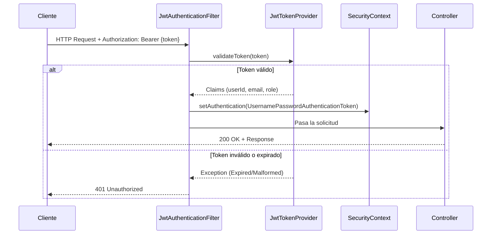
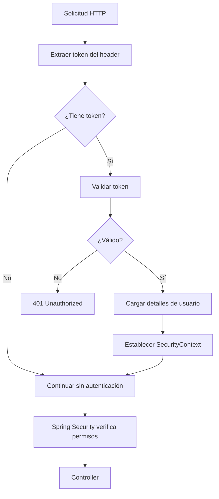
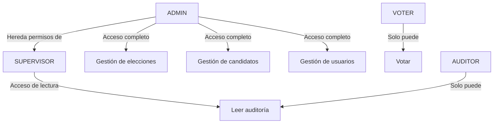
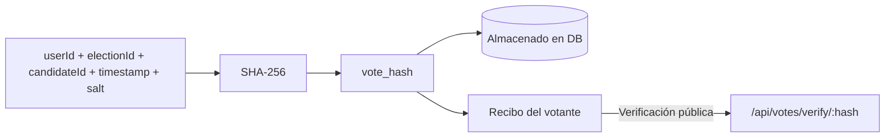

# Seguridad

MiVoto implementa un modelo de seguridad multicapa basado en **JWT stateless**, **BCrypt** para contraseñas y **control de acceso basado en roles (RBAC)**.

## Arquitectura de Seguridad



## JWT (JSON Web Tokens)

### Configuración

| Parámetro | Valor |
|---|---|
| Algoritmo | HMAC-SHA256 (HS256) |
| Expiración del access token | 8 horas (28,800,000 ms) |
| Librería | JJWT 0.12.3 |
| Header | `Authorization: Bearer {token}` |

### Estructura del Token

**Header:**
```json
{ "alg": "HS256", "typ": "JWT" }
```

**Payload (Claims):**
```json
{
  "sub": "1",
  "email": "juan@example.com",
  "role": "VOTER",
  "documentNumber": "12345678",
  "iat": 1730450000,
  "exp": 1730478800
}
```

### JwtTokenProvider

El componente `JwtTokenProvider` es responsable de:

```java
// Generación de token
String generateToken(User user)

// Validación completa (firma + expiración + formato)
boolean validateToken(String token)

// Extracción de claims
String getUserIdFromToken(String token)
String getEmailFromToken(String token)
String getRoleFromToken(String token)
```

**Excepciones manejadas:**
- `ExpiredJwtException` → `401 Unauthorized`
- `MalformedJwtException` → `401 Unauthorized`
- `SignatureException` → `401 Unauthorized`
- `UnsupportedJwtException` → `401 Unauthorized`

### JwtAuthenticationFilter

Intercepta **todas** las solicitudes HTTP antes del procesamiento de controladores:



## Control de Acceso por Roles (RBAC)

### Jerarquía de Roles



### Matriz de Permisos

| Endpoint | VOTER | ADMIN | SUPERVISOR | AUDITOR | Público |
|---|:---:|:---:|:---:|:---:|:---:|
| `GET /api/elections` | ✅ | ✅ | ✅ | ✅ | ✅ |
| `POST /api/elections` | ❌ | ✅ | ❌ | ❌ | ❌ |
| `PUT /api/elections/{id}` | ❌ | ✅ | ❌ | ❌ | ❌ |
| `POST /api/elections/{id}/start` | ❌ | ✅ | ❌ | ❌ | ❌ |
| `GET /api/elections/{id}/results` | ❌ | ✅ | ✅ | ❌ | ❌ |
| `GET /api/candidates` | ✅ | ✅ | ✅ | ✅ | ✅ |
| `POST /api/candidates` | ❌ | ✅ | ❌ | ❌ | ❌ |
| `POST /api/votes` | ✅ | ✅ | ❌ | ❌ | ❌ |
| `GET /api/votes/verify/{hash}` | ✅ | ✅ | ✅ | ✅ | ✅ |
| `GET /api/audit/**` | ❌ | ✅ | ✅ | ✅ | ❌ |
| `GET /api/statistics/**` | ❌ | ✅ | ✅ | ❌ | ❌ |
| `GET /api/users` | ❌ | ✅ | ❌ | ❌ | ❌ |

### Configuración en Spring Security

```java
http.authorizeHttpRequests(auth -> auth
    // Rutas públicas
    .requestMatchers("/api/auth/**").permitAll()
    .requestMatchers("/api/health").permitAll()
    .requestMatchers(HttpMethod.GET, "/api/elections/**").permitAll()
    .requestMatchers(HttpMethod.GET, "/api/candidates/**").permitAll()
    .requestMatchers("/swagger-ui/**", "/v3/api-docs/**").permitAll()

    // Solo VOTER o ADMIN pueden votar
    .requestMatchers(HttpMethod.POST, "/api/votes/**")
        .hasAnyRole("VOTER", "ADMIN")

    // Solo ADMIN puede gestionar
    .requestMatchers(HttpMethod.POST, "/api/elections/**")
        .hasRole("ADMIN")
    .requestMatchers("/api/users/**")
        .hasRole("ADMIN")

    // ADMIN y SUPERVISOR para reportes
    .requestMatchers("/api/audit/**", "/api/statistics/**")
        .hasAnyRole("ADMIN", "SUPERVISOR")

    .anyRequest().authenticated()
)
```

## Seguridad de Contraseñas

Las contraseñas se almacenan usando **BCrypt** con un factor de costo configurable:

```java
@Bean
public PasswordEncoder passwordEncoder() {
    return new BCryptPasswordEncoder();
}
```

BCrypt genera automáticamente un salt único por contraseña, lo que previene ataques de rainbow table.

## Prevención de Doble Voto

La base de datos tiene una restricción única compuesta `(user_id, election_id)` en la tabla `votes`, garantizando a nivel de base de datos que ningún usuario pueda emitir más de un voto por elección. Adicionalmente, la capa de aplicación verifica el estado antes de procesar el voto.

## Auditoría de Seguridad

Cada evento de seguridad es registrado en `audit_logs` con:
- ID del usuario
- Tipo de acción (`LOGIN`, `LOGOUT`, `VOTE_CAST`, etc.)
- IP de origen
- User-Agent del cliente
- Timestamp

## Configuración CORS

```yaml
cors:
  allowed-origins:
    - "http://localhost:4200"
    - "https://app.mivoto.pe"
  allowed-methods: GET, POST, PUT, DELETE, OPTIONS
  allowed-headers: "*"
  allow-credentials: true
  max-age: 3600
```

## Integridad del Voto

Cada voto genera un hash **SHA-256** que incluye:
- ID del usuario
- ID de la elección
- ID del candidato
- Timestamp del voto
- Salt aleatorio

Este hash permite al votante verificar su voto sin revelar por quién votó.


