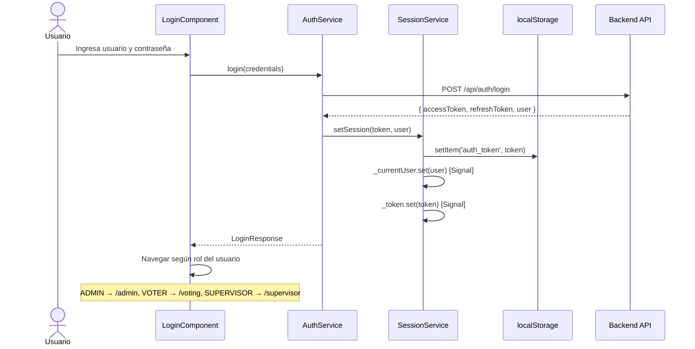
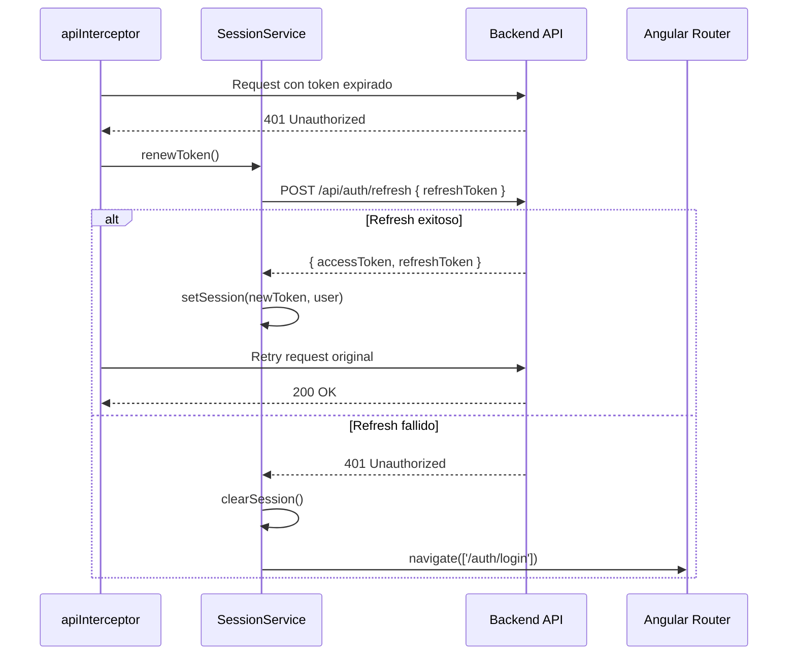
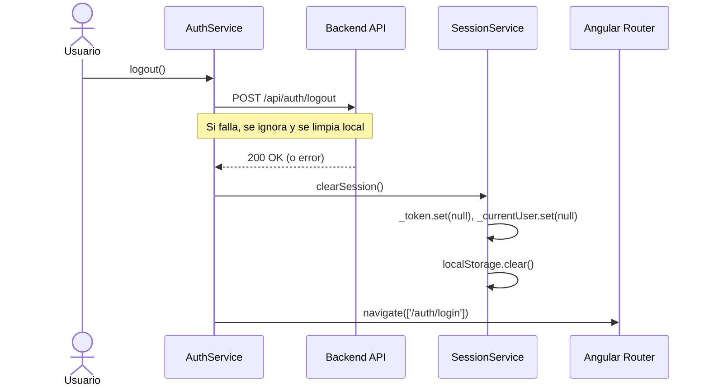

# Autenticación en el Frontend

El frontend implementa autenticación JWT con renovación automática de tokens y persistencia de sesión en localStorage.

## Flujo de Login



## SessionService

El `SessionService` es el núcleo del manejo de sesión. Usa **Angular Signals** para estado reactivo:

```typescript
@Injectable({ providedIn: 'root' })
export class SessionService {
  private _currentUser = signal<User | null>(null);
  private _token = signal<string | null>(null);

  // Computed signals- actualizados automáticamente
  isAuthenticated = computed(() => !!this._token());
  userRole = computed(() => this._currentUser()?.role ?? null);
  currentUser = this._currentUser.asReadonly();

  setSession(token: string, user: User): void {
    this._token.set(token);
    this._currentUser.set(user);
    this.storage.setItem('auth_token', token);
  }

  clearSession(): void {
    this._token.set(null);
    this._currentUser.set(null);
    this.storage.removeItem('auth_token');
  }

  async renewToken(): Promise<boolean> {
    const refreshToken = this.storage.getItem('refresh_token');
    if (!refreshToken) return false;
    // Llama al backend para renovar y actualiza la sesión
    ...
  }
}
```

## apiInterceptor- Adjuntar Token

Todos los requests HTTP incluyen automáticamente el token Bearer:

```typescript
export const apiInterceptor: HttpInterceptorFn = (req, next) => {
  const session = inject(SessionService);
  const token = session.currentToken();

  if (token) {
    req = req.clone({
      setHeaders: { Authorization: `Bearer ${token}` }
    });
  }

  return next(req).pipe(
    catchError((error: HttpErrorResponse) => {
      if (error.status === 401) {
        // Intenta renovar el token automáticamente
        return session.renewToken().pipe(
          switchMap(success => success ? next(reqWithNewToken) : redirectToLogin())
        );
      }
      return throwError(() => error);
    })
  );
};
```

## Flujo de Renovación de Token



## errorInterceptor- Manejo Global de Errores

El `errorInterceptor` convierte errores HTTP en mensajes amigables para el usuario:

```typescript
export const errorInterceptor: HttpInterceptorFn = (req, next) => {
  return next(req).pipe(
    catchError((error: HttpErrorResponse) => {
      // Saltar ciertos endpoints (ej. /auth/refresh para evitar bucles)
      if (shouldSkip(req.url)) return throwError(() => error);

      const message = getHumanReadableMessage(error);
      inject(DialogService).showError(message);
      return throwError(() => error);
    })
  );
};
```

**Mensajes por código HTTP:**
- `400` → "Los datos ingresados no son válidos"
- `401` → "Tu sesión ha expirado, por favor inicia sesión"
- `403` → "No tienes permisos para realizar esta acción"
- `404` → "El recurso solicitado no fue encontrado"
- `409` → "Ya has votado en esta elección"
- `500` → "Error interno del servidor, inténtalo más tarde"

## Persistencia de Sesión

| Clave en localStorage | Contenido |
|---|---|
| `auth_token` | JWT de acceso |
| `refresh_token` | JWT de refresco |

Al recargar la aplicación:
1. `SessionService` lee `auth_token` de localStorage
2. Verifica que el token no esté expirado
3. Si expiró, intenta renovar con `refresh_token`
4. Si la renovación falla, redirige a `/auth/login`

## Directiva HasRole

Oculta/muestra elementos del DOM según el rol del usuario:

```html
<!-- Solo visible para ADMIN -->
<button *appHasRole="['ADMIN']">Gestionar Elecciones</button>

<!-- Visible para ADMIN y SUPERVISOR -->
<a *appHasRole="['ADMIN', 'SUPERVISOR']">Ver Resultados</a>
```

```typescript
@Directive({ selector: '[appHasRole]', standalone: true })
export class HasRoleDirective {
  @Input('appHasRole') roles: string[] = [];

  constructor(private session: SessionService, private template: TemplateRef<any>,
              private viewContainer: ViewContainerRef) {
    effect(() => {
      const userRole = this.session.userRole();
      if (this.roles.includes(userRole ?? '')) {
        this.viewContainer.createEmbeddedView(this.template);
      } else {
        this.viewContainer.clear();
      }
    });
  }
}
```

## Logout



El logout funciona incluso si el backend no responde, ya que la limpieza local es independiente de la respuesta del servidor.
