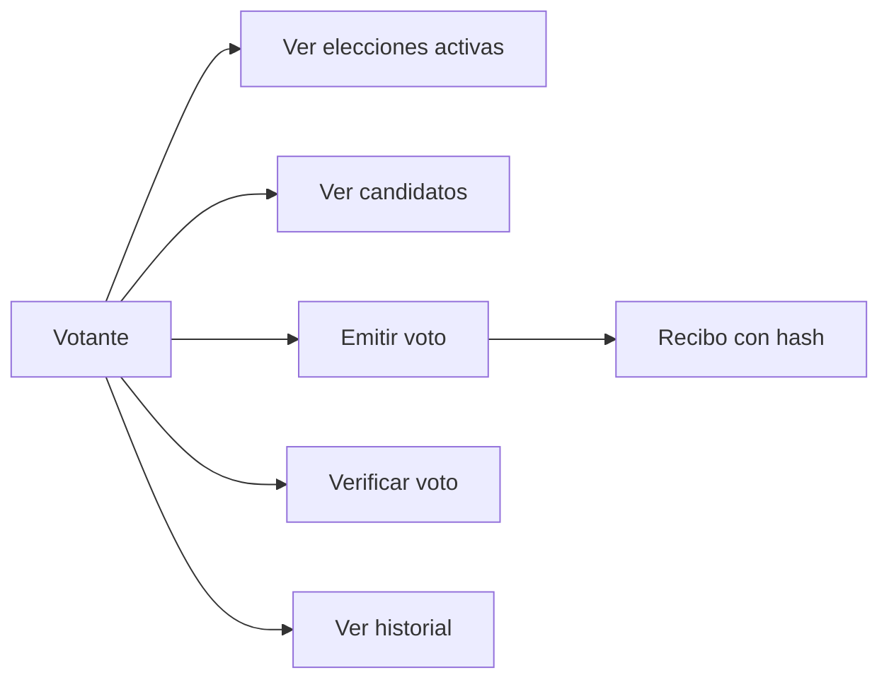
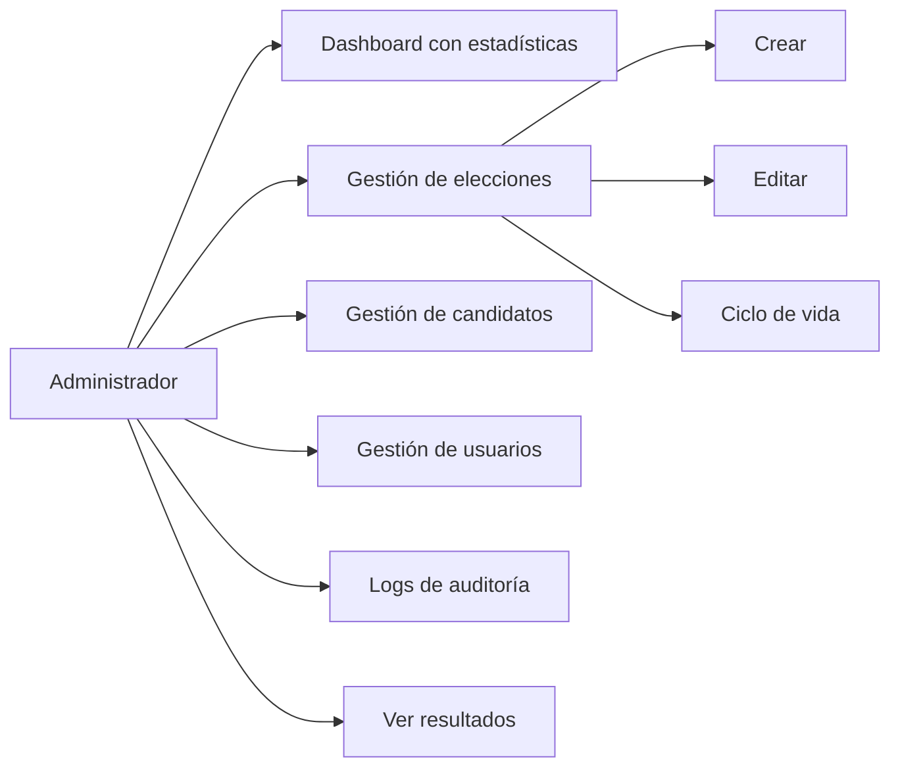

# Funcionalidades por Rol

MiVoto tiene tres interfaces diferenciadas según el rol del usuario. Cada sección se carga de forma diferida (lazy loading).

## Votante (VOTER)- `/voting`



### ElectionsListComponent (`/voting`)

Muestra todas las elecciones en estado `ACTIVE`. El votante puede ver:
- Título y descripción de la elección
- Fechas de inicio y cierre
- Si ya votó en esa elección (badge "Ya votaste")
- Acceso al detalle de la elección

**Datos cargados:** `GET /api/elections/active` + `GET /api/votes/status/{electionId}` por cada elección

---

### ElectionDetailComponent (`/voting/election/:id`)

Muestra los candidatos de una elección activa y permite emitir el voto.

**Flujo de votación:**
1. Se cargan los candidatos: `GET /api/candidates/election/{id}/active`
2. El usuario selecciona un candidato (o voto en blanco si la elección lo permite)
3. Se muestra un diálogo de confirmación con el nombre del candidato
4. Al confirmar: `POST /api/votes` con `{ electionId, candidateId }`
5. Si exitoso, navega a `/voting/confirmation` con el recibo en el estado de navegación

---

### VoteConfirmationComponent (`/voting/confirmation`)

Muestra el recibo del voto emitido. El usuario ve:
- Hash SHA-256 único del voto (64 caracteres)
- Nombre de la elección
- Candidato elegido
- Fecha y hora del voto
- Código de verificación (si aplica)
- Botón para copiar el hash
- Enlace para verificar el voto en `/voting/verify`

**Datos:** Recibidos desde el estado de navegación (no requiere API call).

---

### VoteVerificationComponent (`/voting/verify`)

Permite a cualquier usuario (incluso sin login) verificar la integridad de un voto ingresando su hash.

**Flujo:**
1. Usuario ingresa el hash de 64 caracteres
2. `GET /api/votes/verify/{hash}`
3. Se muestra si el voto es válido, la elección a la que pertenece y si fue verificado

---

### VotingHistoryComponent (`/voting/history`)

Muestra el historial completo de votos del usuario autenticado.

**Datos:** `GET /api/votes/history`

**Columnas:** Elección, fecha del voto, estado, hash, verificado

---

## Administrador (ADMIN)- `/admin`



### AdminDashboardComponent (`/admin`)

Panel principal con:
- Estadísticas del sistema: total elecciones, votos, candidatos, usuarios
- Elecciones recientes con su estado
- Accesos rápidos a gestión de elecciones y candidatos
- Gráficas de participación (si hay elecciones activas)

**Datos:** `GET /api/statistics/system`

---

### ElectionsManagementComponent (`/admin/elections`)

CRUD completo de elecciones con gestión del ciclo de vida.

**Funcionalidades:**
- **Listar** todas las elecciones con filtro por estado
- **Crear** nueva elección (modal con formulario)
- **Editar** elecciones en estado DRAFT o SCHEDULED
- **Programar** (`POST /api/elections/{id}/schedule`)- DRAFT → SCHEDULED
- **Iniciar** (`POST /api/elections/{id}/start`)- SCHEDULED → ACTIVE
- **Cerrar** (`POST /api/elections/{id}/close`)- ACTIVE → CLOSED
- **Cancelar** (`POST /api/elections/{id}/cancel`)
- **Ver resultados** → navega a `/admin/results/{id}`

**Validaciones del formulario:**
- Título: requerido, máx. 200 caracteres
- Descripción: opcional
- Fecha inicio: requerida, debe ser futura
- Fecha fin: requerida, debe ser posterior a inicio

---

### CandidatesManagementComponent (`/admin/candidates`)

Gestión de candidatos por elección.

**Funcionalidades:**
- Seleccionar elección (dropdown)
- Listar candidatos de la elección seleccionada
- **Crear** candidato (nombre, partido, número, foto, descripción)
- **Editar** candidato
- **Activar / Desactivar** candidato
- **Eliminar** candidato (con confirmación)

**Restricción:** No se pueden agregar candidatos a elecciones en estado ACTIVE o CLOSED.

---

### UsersManagementComponent (`/admin/users`)

Gestión completa de usuarios del sistema.

**Funcionalidades:**
- Listar todos los usuarios con filtro por rol y estado
- **Crear** usuario (documento, nombre, email, contraseña temporal, rol)
- **Editar** datos del usuario
- **Activar / Desactivar** usuario
- **Eliminar** usuario (con confirmación)
- Asignar roles: VOTER, ADMIN, SUPERVISOR, AUDITOR

---

### AuditLogsComponent (`/admin/audit`)

Visualización del log de auditoría del sistema.

**Filtros disponibles:**
- Por usuario (ID o nombre)
- Por tipo de acción (LOGIN, VOTE_CAST, ELECTION_CREATED, etc.)
- Por entidad y ID de entidad
- Por rango de fechas

**Columnas:** Timestamp, Usuario, Acción, Entidad, IP, Descripción

**Datos:**
- `GET /api/audit`- todos los registros
- `GET /api/audit/security`- solo accesos y sesiones
- `GET /api/audit/voting`- solo eventos de votación

---

### ElectionResultsComponent (`/admin/results/:id`)

Resultados detallados de una elección cerrada. Compartido con el rol SUPERVISOR en `/supervisor/results/:id`.

**Información mostrada:**
- Total de votos emitidos
- Tabla de candidatos con votos y porcentaje
- Ganador destacado (mayor porcentaje)
- Gráfica de barras de resultados
- Participación por hora del día

**Datos:**
- `GET /api/elections/{id}/results`
- `GET /api/statistics/election/{id}/participation`

---

## Supervisor (SUPERVISOR)- `/supervisor`

El supervisor tiene acceso de solo lectura a elecciones y resultados.

### SupervisorElectionsComponent (`/supervisor`)

Lista todas las elecciones con acceso para ver resultados de las cerradas.

**Datos:** `GET /api/elections`- todas las elecciones

---

### ElectionResultsComponent (`/supervisor/results/:id`)

Idéntico al de Admin- el mismo componente, diferentes permisos de navegación.

---

### UserSettingsComponent (`/admin/settings`, `/supervisor/settings`)

Configuración del perfil del usuario autenticado. Compartido entre Admin y Supervisor.

**Funcionalidades:**
- Ver datos del perfil
- Cambiar contraseña (`POST /api/auth/change-password`)

---

## Funcionalidades Compartidas

### Exportación a Excel

Los componentes de administración (elecciones, usuarios, auditoría) ofrecen exportación a Excel usando la librería `xlsx`:

```typescript
exportToExcel(data: any[], filename: string): void {
  const worksheet = XLSX.utils.json_to_sheet(data);
  const workbook = XLSX.utils.book_new();
  XLSX.utils.book_append_sheet(workbook, worksheet, 'Data');
  XLSX.writeFile(workbook, `${filename}.xlsx`);
}
```

### Internacionalización

La aplicación usa `@ngx-translate` con el locale `es-PE`. Los textos están en archivos de traducción en `assets/i18n/es.json`.

### Formato de Fechas

Todas las fechas se muestran en formato peruano usando el pipe `dateFormat`:
- Fechas: `DD/MM/YYYY`
- Fechas con hora: `DD/MM/YYYY HH:mm`
- Tiempo relativo: `hace X minutos/horas/días` (pipe `dateAgo`)
