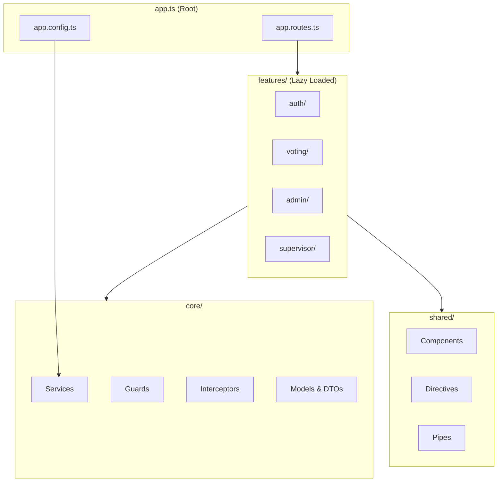

# Frontend- Visión General

El frontend de MiVoto es una **Single Page Application (SPA)** construida con **Angular 20**. Utiliza componentes standalone, signals para manejo de estado y lazy loading para todas las rutas.

## Stack Tecnológico

| Tecnología | Versión | Uso |
|---|---|---|
| Angular | 20.3.0 | Framework base |
| TypeScript | 5.9.2 | Lenguaje principal |
| RxJS | 7.8.0 | Programación reactiva |
| Angular Signals | 20.x | Estado reactivo sin NgRx |
| @auth0/angular-jwt | 5.2.0 | Decodificación y manejo de JWT |
| @ngx-translate | 17.0.0 | Internacionalización (ES-PE) |
| dayjs | 1.11.19 | Manipulación de fechas |
| xlsx | 0.18.5 | Exportación a Excel |

## Arquitectura de la Aplicación



## Principios de Diseño

### Standalone Components
Todos los componentes declaran `standalone: true`. No hay NgModules. Las dependencias se declaran en el array `imports` de cada componente.

### Signal-Based State
El estado reactivo se gestiona con Angular Signals sin bibliotecas externas (no NgRx, no Akita):

```typescript
// SessionService
private _currentUser = signal<User | null>(null);
private _token = signal<string | null>(null);

isAuthenticated = computed(() => !!this._token());
userRole = computed(() => this._currentUser()?.role ?? null);
```

### Lazy Loading
Cada sección de la app se carga de forma diferida:

```typescript
// app.routes.ts
{ path: 'voting', loadChildren: () => import('./features/voting/...') },
{ path: 'admin', loadChildren: () => import('./features/admin/...') },
{ path: 'supervisor', loadChildren: () => import('./features/supervisor/...') },
```

### Zoneless Change Detection
La aplicación usa `provideZonelessChangeDetection()` para mejor rendimiento, eliminando la dependencia de Zone.js.

## Estructura de Carpetas

```
src/app/
├── core/
│   ├── constants/          - ROLES, APP_ROUTES
│   ├── enums/              - AuditAction
│   ├── guards/             - authGuard, sessionGuard, roleGuard
│   ├── interceptors/       - apiInterceptor, errorInterceptor
│   ├── models/             - User, Election, Candidate, ApiResponse
│   ├── dtos/               - Request/Response DTOs por módulo
│   └── services/           - Servicios de negocio e infraestructura
│
├── features/
│   ├── auth/               - Login, ForgotPassword
│   ├── voting/             - ElectionsList, ElectionDetail, VoteConfirmation, ...
│   ├── admin/              - Dashboard, Elections, Candidates, Users, Audit, ...
│   └── supervisor/         - ElectionsList, Results, Settings
│
├── shared/
│   ├── components/         - Btn, Checkbox, Switch, Card, Loader, Alert, Dialog, ...
│   ├── directives/         - HasRole, ImgFallback, ClickOutside
│   └── pipes/              - DateFormat, ElectionStatus, RoleLabel, DateAgo, EmptyValue
│
├── app.ts                  - Componente raíz
├── app.routes.ts           - Enrutamiento principal
└── app.config.ts           - Configuración de la aplicación
```

## Servicios Principales

| Servicio | Responsabilidad |
|---|---|
| `AuthService` | Login, logout, cambio de contraseña |
| `SessionService` | Estado de sesión con Signals (currentUser, token, isAuthenticated) |
| `ApiService` | Wrapper HTTP genérico (GET, POST, PUT, DELETE) |
| `ElectionService` | CRUD y ciclo de vida de elecciones |
| `VotingService` | Emisión y verificación de votos |
| `CandidateService` | Gestión de candidatos |
| `UserService` | CRUD de usuarios |
| `AuditService` | Consulta de logs de auditoría |
| `StatisticsService` | Estadísticas del sistema y elecciones |
| `DialogService` | Gestión de diálogos modales dinámicos |
| `StorageService` | Abstracción sobre localStorage |

## Configuración de la Aplicación

```typescript
// app.config.ts
export const appConfig: ApplicationConfig = {
  providers: [
    provideZonelessChangeDetection(),
    provideRouter(routes),
    provideHttpClient(withInterceptors([apiInterceptor, errorInterceptor])),
    provideTranslateService({ loader: { provide: TranslateLoader, useFactory: ... } }),
    { provide: LOCALE_ID, useValue: 'es-PE' },
  ]
};
```

## Entornos de Configuración

| Archivo | Perfil | `apiUrl` |
|---|---|---|
| `environment.ts` | Default | `http://localhost:8080/api` |
| `environment.local.ts` | Local | `http://localhost:8080/api` |
| `environment.dev.ts` | Dev | `https://api-dev.mivoto.pe/api` |
| `environment.qa.ts` | QA | `https://api-qa.mivoto.pe/api` |
| `environment.prod.ts` | Prod | `https://api.mivoto.pe/api` |
