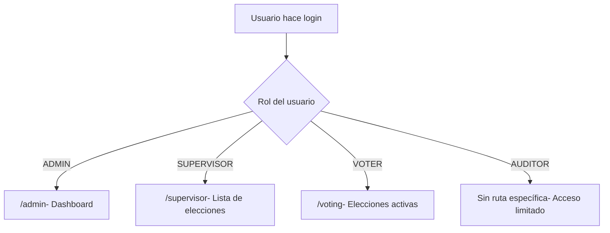

# Enrutamiento

MiVoto utiliza el router de Angular con **lazy loading** para todas las secciones y **guards** para proteger rutas según autenticación y rol.

## Mapa de Rutas

```mermaid
graph TD
    ROOT["/"] -->|redirect| AUTH_LOGIN["/auth/login"]
    ROOT --> AUTH["/auth"]
    ROOT --> VOTING["/voting"]
    ROOT --> ADMIN["/admin"]
    ROOT --> SUPERVISOR["/supervisor"]

    AUTH --> AUTH_LOGIN_C["/auth/login- LoginComponent"]
    AUTH --> AUTH_FP["/auth/forgot-password- ForgotPasswordComponent"]

    VOTING --> V_LIST["/voting- ElectionsListComponent"]
    VOTING --> V_DETAIL["/voting/election/:id- ElectionDetailComponent"]
    VOTING --> V_CONFIRM["/voting/confirmation- VoteConfirmationComponent"]
    VOTING --> V_VERIFY["/voting/verify- VoteVerificationComponent"]
    VOTING --> V_HISTORY["/voting/history- VotingHistoryComponent"]

    ADMIN --> A_DASH["/admin- AdminDashboardComponent"]
    ADMIN --> A_ELEC["/admin/elections- ElectionsManagementComponent"]
    ADMIN --> A_CAND["/admin/candidates- CandidatesManagementComponent"]
    ADMIN --> A_USERS["/admin/users- UsersManagementComponent"]
    ADMIN --> A_AUDIT["/admin/audit- AuditLogsComponent"]
    ADMIN --> A_SETTINGS["/admin/settings- UserSettingsComponent"]
    ADMIN --> A_RESULTS["/admin/results/:id- ElectionResultsComponent"]

    SUPERVISOR --> S_ELECTIONS["/supervisor- SupervisorElectionsComponent"]
    SUPERVISOR --> S_RESULTS["/supervisor/results/:id- ElectionResultsComponent"]
    SUPERVISOR --> S_SETTINGS["/supervisor/settings- UserSettingsComponent"]
```



## Guards de Protección

### `authGuard`

Protege las rutas de autenticación (`/auth/**`). Si el usuario **ya está autenticado**, lo redirige a su dashboard correspondiente según su rol:

```typescript
export const authGuard: CanActivateFn = () => {
  const session = inject(SessionService);
  const router = inject(Router);

  if (session.isAuthenticated()) {
    const role = session.userRole();
    if (role === 'ADMIN') return router.createUrlTree(['/admin']);
    if (role === 'SUPERVISOR') return router.createUrlTree(['/supervisor']);
    return router.createUrlTree(['/voting']);
  }
  return true; // Puede acceder a /auth
};
```

### `sessionGuard`

Protege todas las rutas que requieren autenticación. Verifica que exista un token válido; si no, redirige a `/auth/login`:

```typescript
export const sessionGuard: CanActivateFn = async () => {
  const session = inject(SessionService);
  const router = inject(Router);

  if (!session.isAuthenticated()) {
    // Intenta renovar el token
    const renewed = await session.renewToken();
    if (!renewed) {
      return router.createUrlTree(['/auth/login']);
    }
  }
  return true;
};
```

### `roleGuard`

Verifica que el usuario tenga el rol requerido para acceder a la ruta. Se configura con `data: { role: 'ADMIN' }`:

```typescript
export const roleGuard: CanActivateFn = (route) => {
  const session = inject(SessionService);
  const router = inject(Router);
  const requiredRole = route.data['role'];

  if (session.userRole() !== requiredRole) {
    // Redirige al dashboard del rol actual
    return router.createUrlTree([getDefaultRoute(session.userRole())]);
  }
  return true;
};
```

## Configuración Completa de Rutas

### Rutas Principales (`app.routes.ts`)

```typescript
export const routes: Routes = [
  { path: '', redirectTo: '/auth', pathMatch: 'full' },

  {
    path: 'auth',
    loadChildren: () => import('./features/auth/auth.routes'),
    canActivate: [authGuard],
  },
  {
    path: 'voting',
    loadChildren: () => import('./features/voting/voting.routes'),
    canActivate: [sessionGuard, roleGuard],
    data: { role: ROLES.VOTER },
  },
  {
    path: 'admin',
    loadChildren: () => import('./features/admin/admin.routes'),
    canActivate: [sessionGuard, roleGuard],
    data: { role: ROLES.ADMIN },
  },
  {
    path: 'supervisor',
    loadChildren: () => import('./features/supervisor/supervisor.routes'),
    canActivate: [sessionGuard, roleGuard],
    data: { role: ROLES.SUPERVISOR },
  },
  { path: '**', redirectTo: '' },
];
```

### Rutas de Votación (`/voting`)

```typescript
export const VOTING_ROUTES: Routes = [
  { path: '', component: ElectionsListComponent },
  { path: 'election/:id', component: ElectionDetailComponent },
  { path: 'confirmation', component: VoteConfirmationComponent },
  { path: 'verify', component: VoteVerificationComponent },
  { path: 'history', component: VotingHistoryComponent },
];
```

### Rutas de Admin (`/admin`)

```typescript
export const ADMIN_ROUTES: Routes = [
  { path: '', component: AdminDashboardComponent },
  { path: 'elections', component: ElectionsManagementComponent },
  { path: 'candidates', component: CandidatesManagementComponent },
  { path: 'users', component: UsersManagementComponent },
  { path: 'audit', component: AuditLogsComponent },
  { path: 'settings', component: UserSettingsComponent },
  { path: 'results/:id', component: ElectionResultsComponent },
];
```

### Rutas de Supervisor (`/supervisor`)

```typescript
export const SUPERVISOR_ROUTES: Routes = [
  { path: '', component: SupervisorElectionsComponent },
  { path: 'results/:id', component: ElectionResultsComponent },
  { path: 'settings', component: UserSettingsComponent },
];
```

## Flujo de Navegación Post-Login



## Constantes de Rutas

Las rutas se definen como constantes en `core/constants/routes.constants.ts` para evitar strings hardcodeados:

```typescript
export const APP_ROUTES = {
  AUTH: {
    LOGIN: '/auth/login',
    FORGOT_PASSWORD: '/auth/forgot-password',
  },
  VOTING: {
    LIST: '/voting',
    ELECTION: (id: number) => `/voting/election/${id}`,
    CONFIRMATION: '/voting/confirmation',
    VERIFY: '/voting/verify',
    HISTORY: '/voting/history',
  },
  ADMIN: {
    DASHBOARD: '/admin',
    ELECTIONS: '/admin/elections',
    CANDIDATES: '/admin/candidates',
    USERS: '/admin/users',
    AUDIT: '/admin/audit',
    RESULTS: (id: number) => `/admin/results/${id}`,
  },
  SUPERVISOR: {
    HOME: '/supervisor',
    RESULTS: (id: number) => `/supervisor/results/${id}`,
  },
} as const;
```
