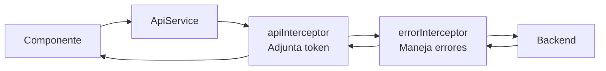

# Comunicación Frontend-Backend via API REST

Esta página documenta los patrones de comunicación HTTP entre el frontend Angular y el backend Spring Boot.

## ApiService- Wrapper HTTP

`ApiService` es el wrapper genérico sobre `HttpClient` de Angular. Todos los servicios de dominio lo usan en lugar de `HttpClient` directamente:

```typescript
@Injectable({ providedIn: 'root' })
export class ApiService {
  private http = inject(HttpClient);
  private baseUrl = environment.apiUrl;

  get<T>(endpoint: string, params?: HttpParams): Observable<ApiResponse<T>> {
    return this.http.get<ApiResponse<T>>(`${this.baseUrl}/${endpoint}`, { params });
  }

  post<T>(endpoint: string, body: unknown): Observable<ApiResponse<T>> {
    return this.http.post<ApiResponse<T>>(`${this.baseUrl}/${endpoint}`, body);
  }

  put<T>(endpoint: string, body: unknown): Observable<ApiResponse<T>> {
    return this.http.put<ApiResponse<T>>(`${this.baseUrl}/${endpoint}`, body);
  }

  delete<T>(endpoint: string): Observable<ApiResponse<T>> {
    return this.http.delete<ApiResponse<T>>(`${this.baseUrl}/${endpoint}`);
  }
}
```

## Ejemplo de Servicio de Dominio

```typescript
@Injectable({ providedIn: 'root' })
export class ElectionService {
  private api = inject(ApiService);

  getAll(): Observable<ApiResponse<Election[]>> {
    return this.api.get<Election[]>('elections');
  }

  getActive(): Observable<ApiResponse<Election[]>> {
    return this.api.get<Election[]>('elections/active');
  }

  create(request: CreateElectionRequest): Observable<ApiResponse<Election>> {
    return this.api.post<Election>('elections', request);
  }

  start(id: number): Observable<ApiResponse<Election>> {
    return this.api.post<Election>(`elections/${id}/start`, {});
  }

  getResults(id: number): Observable<ApiResponse<ElectionResultsDto>> {
    return this.api.get<ElectionResultsDto>(`elections/${id}/results`);
  }
}
```

## Uso en Componentes

```typescript
@Component({ ... })
export class ElectionsManagementComponent {
  elections = signal<Election[]>([]);
  isLoading = signal(false);
  private electionService = inject(ElectionService);

  loadElections(): void {
    this.isLoading.set(true);
    this.electionService.getAll().subscribe({
      next: (response) => {
        this.elections.set(response.data);
        this.isLoading.set(false);
      },
      error: () => this.isLoading.set(false)
      // errorInterceptor ya maneja el diálogo de error
    });
  }

  startElection(id: number): void {
    this.dialog.showConfirm({
      title: '¿Iniciar elección?',
      message: 'Los votantes podrán emitir sus votos inmediatamente.',
    }).subscribe(confirmed => {
      if (!confirmed) return;
      this.electionService.start(id).subscribe(() => this.loadElections());
    });
  }
}
```

## Manejo de Parámetros de Query

Para endpoints con filtros por parámetros:

```typescript
// AuditService
getByDateRange(startDate: string, endDate: string): Observable<ApiResponse<AuditLog[]>> {
  const params = new HttpParams()
    .set('startDate', startDate)
    .set('endDate', endDate);
  return this.api.get<AuditLog[]>('audit/date-range', params);
}
```

Genera: `GET /api/audit/date-range?startDate=2025-11-01T00:00:00&endDate=2025-11-01T23:59:59`

## Tabla Completa de Mapeos de Servicios

### AuthService

| Método Angular | HTTP | Endpoint Backend |
|---|---|---|
| `login(credentials)` | POST | `/api/auth/login` |
| `logout()` | POST | `/api/auth/logout` |
| `refreshToken(token)` | POST | `/api/auth/refresh` |
| `changePassword(data)` | POST | `/api/auth/change-password` |
| `getProfile()` | GET | `/api/auth/me` |

### ElectionService

| Método Angular | HTTP | Endpoint Backend |
|---|---|---|
| `getAll()` | GET | `/api/elections` |
| `getActive()` | GET | `/api/elections/active` |
| `getById(id)` | GET | `/api/elections/{id}` |
| `getByStatus(status)` | GET | `/api/elections/status/{status}` |
| `create(data)` | POST | `/api/elections` |
| `update(id, data)` | PUT | `/api/elections/{id}` |
| `schedule(id)` | POST | `/api/elections/{id}/schedule` |
| `start(id)` | POST | `/api/elections/{id}/start` |
| `close(id)` | POST | `/api/elections/{id}/close` |
| `cancel(id)` | POST | `/api/elections/{id}/cancel` |
| `getResults(id)` | GET | `/api/elections/{id}/results` |
| `getStatistics(id)` | GET | `/api/elections/{id}/statistics` |

### VotingService

| Método Angular | HTTP | Endpoint Backend |
|---|---|---|
| `castVote(request)` | POST | `/api/votes` |
| `verify(hash)` | GET | `/api/votes/verify/{hash}` |
| `getHistory()` | GET | `/api/votes/history` |
| `getStatus(electionId)` | GET | `/api/votes/status/{electionId}` |
| `getCount(electionId)` | GET | `/api/votes/election/{electionId}/count` |

### CandidateService

| Método Angular | HTTP | Endpoint Backend |
|---|---|---|
| `register(data)` | POST | `/api/candidates` |
| `getById(id)` | GET | `/api/candidates/{id}` |
| `getByElection(electionId)` | GET | `/api/candidates/election/{electionId}` |
| `getActiveByElection(id)` | GET | `/api/candidates/election/{id}/active` |
| `getByNumber(electionId, n)` | GET | `/api/candidates/election/{id}/number/{n}` |
| `update(id, data)` | PUT | `/api/candidates/{id}` |
| `delete(id)` | DELETE | `/api/candidates/{id}` |
| `activate(id)` | POST | `/api/candidates/{id}/activate` |
| `deactivate(id)` | POST | `/api/candidates/{id}/deactivate` |

### AuditService

| Método Angular | HTTP | Endpoint Backend |
|---|---|---|
| `getAll()` | GET | `/api/audit` |
| `getByUser(userId)` | GET | `/api/audit/user/{userId}` |
| `getByAction(action)` | GET | `/api/audit/action/{action}` |
| `getByDateRange(start, end)` | GET | `/api/audit/date-range` |
| `getCritical()` | GET | `/api/audit/critical` |
| `getSecurity()` | GET | `/api/audit/security` |
| `getVoting()` | GET | `/api/audit/voting` |
| `getReport()` | GET | `/api/audit/report` |

### StatisticsService

| Método Angular | HTTP | Endpoint Backend |
|---|---|---|
| `getSystem()` | GET | `/api/statistics/system` |
| `getElection(id)` | GET | `/api/statistics/election/{id}` |
| `getCandidates(id)` | GET | `/api/statistics/election/{id}/candidates` |
| `getParticipation(id)` | GET | `/api/statistics/election/{id}/participation` |

## Pipeline de Interceptores

Los requests HTTP pasan por dos interceptores en orden:



1. **apiInterceptor**- Adjunta el Bearer token al header `Authorization`
2. **errorInterceptor**- Intercepta errores y muestra mensajes al usuario

Los interceptores son **funcionales** (no basados en clase), registrados en `app.config.ts`:

```typescript
provideHttpClient(
  withInterceptors([apiInterceptor, errorInterceptor])
)
```

## Tipado Completo de Requests y Responses

El frontend define DTOs en `core/dtos/` que reflejan exactamente el contrato de la API:

```typescript
// dtos/election.dto.ts
export interface CreateElectionRequest {
  title: string;
  description?: string;
  startDate: string;       // ISO 8601
  endDate: string;         // ISO 8601
  maxVotesPerUser?: number;
  allowsBlankVote?: boolean;
  requiresVerification?: boolean;
}

export interface ElectionResultsDto {
  electionId: number;
  title: string;
  totalVotes: number;
  candidates: {
    candidateId: number;
    name: string;
    party: string;
    voteCount: number;
    percentage: number;
  }[];
  winner: {
    candidateId: number;
    name: string;
    percentage: number;
  } | null;
}
```

## Convenciones de Fechas

Todas las fechas se transmiten en formato **ISO 8601**:

| Dirección | Formato | Ejemplo |
|---|---|---|
| Frontend → Backend | ISO 8601 (string) | `"2025-11-01T08:00:00"` |
| Backend → Frontend | ISO 8601 (string) | `"2025-11-01T08:00:00"` |
| Visualización | dayjs format | `"01/11/2025 08:00"` |

El backend aplica la zona horaria `America/Lima` (UTC-5) para interpretación y almacenamiento.
