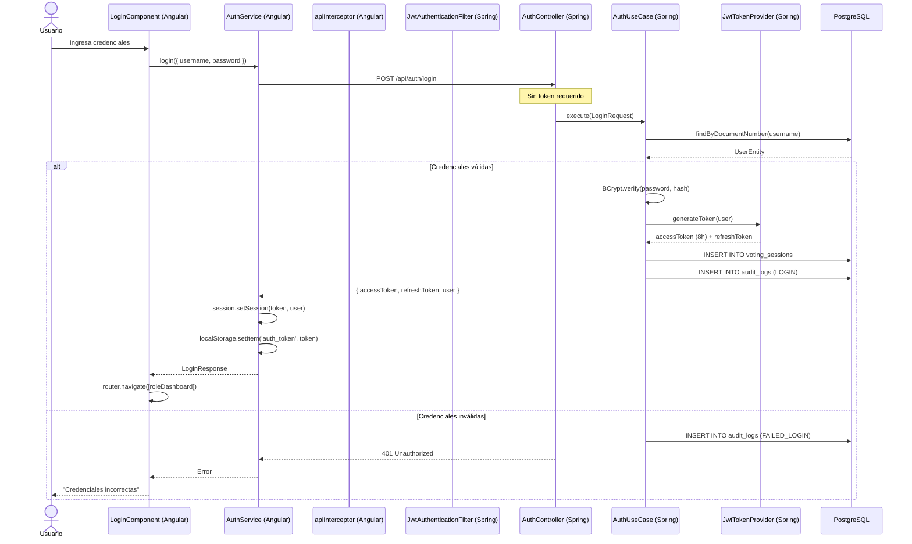
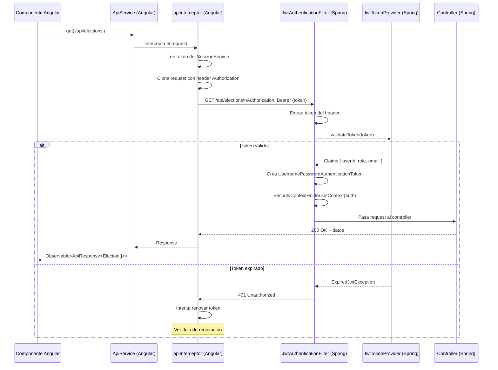
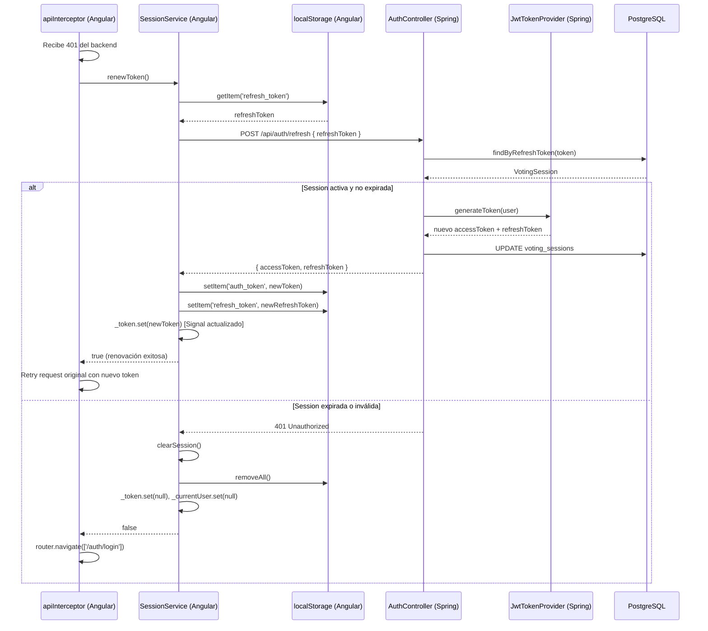
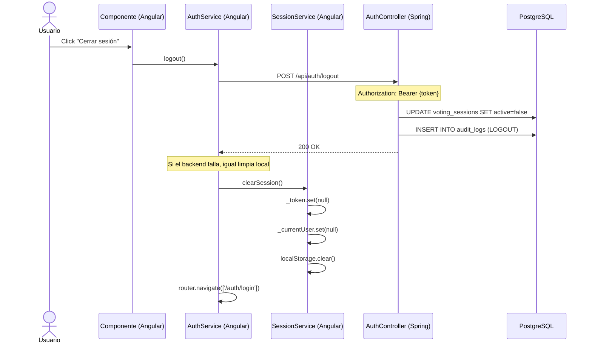
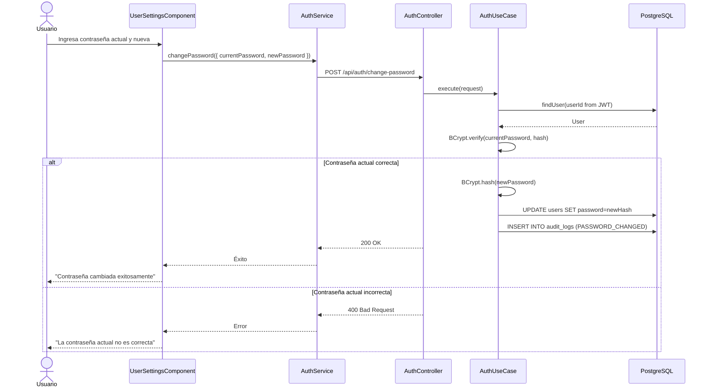
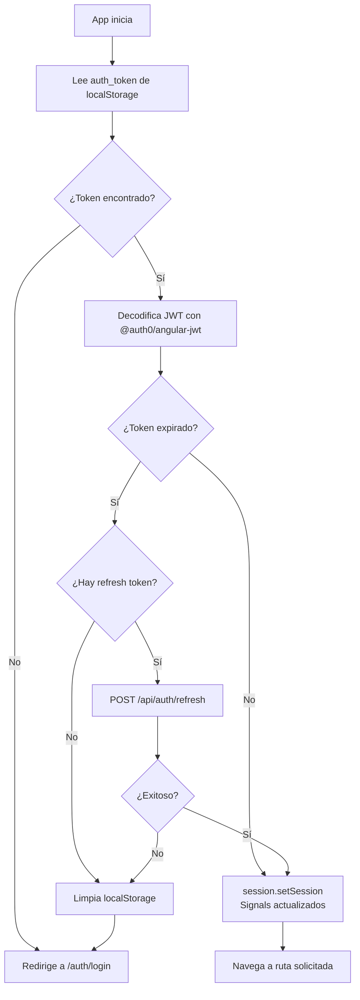

# Flujo de Autenticación End-to-End

Descripción completa del flujo de autenticación entre el frontend Angular y el backend Spring Boot.

## Diagrama General de Autenticación

## Verificación de Token en Cada Request

## Renovación de Token (Token Refresh)

## Flujo de Logout

## Cambio de Contraseña

## Inicialización de la Aplicación

Cuando el usuario recarga la página:

## Seguridad del Almacenamiento de Tokens

| Aspecto | Decisión | Justificación |
|---|---|---|
| Almacenamiento | localStorage | Persistencia entre recargas de página |
| Tipo de token | JWT stateless | No requiere estado en servidor |
| Duración access token | 8 horas | Balance entre seguridad y UX |
| HTTPS | Requerido en producción | Previene intercepción del token |
| Scope del token | Solo backend MiVoto | No compartir con terceros |

:::warning Nota de Seguridad
Los tokens JWT en localStorage son vulnerables a XSS. El frontend debe sanitizar todo contenido dinámico y evitar usar `innerHTML` con datos del servidor.
:::
