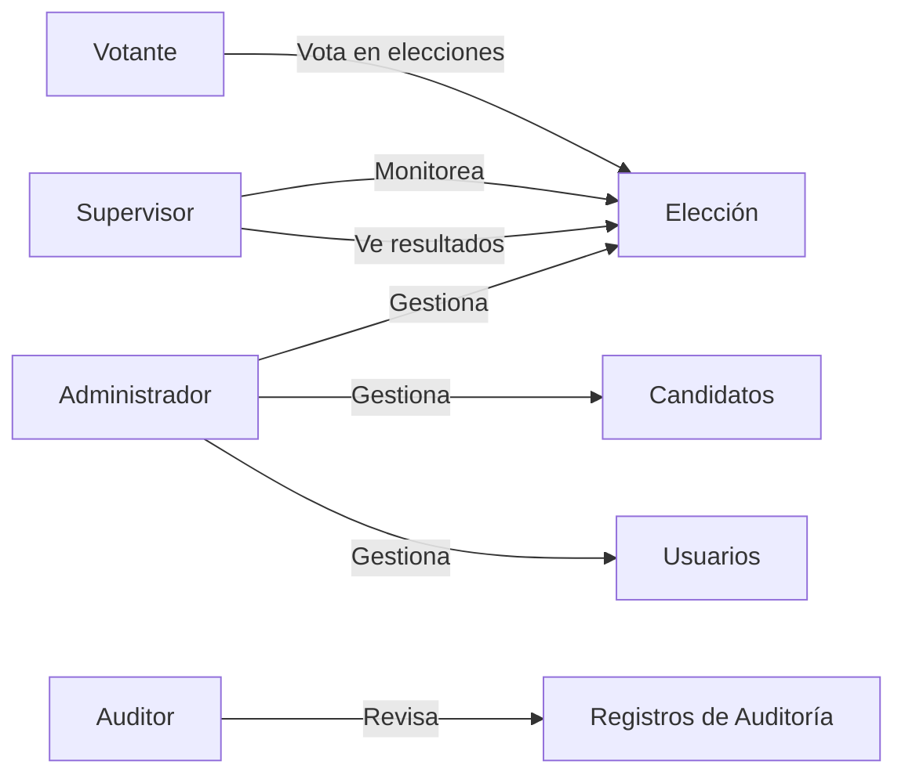
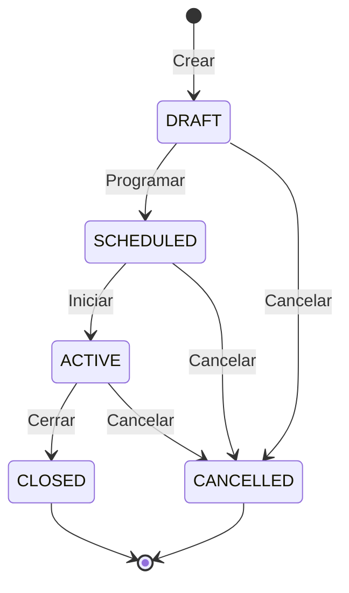
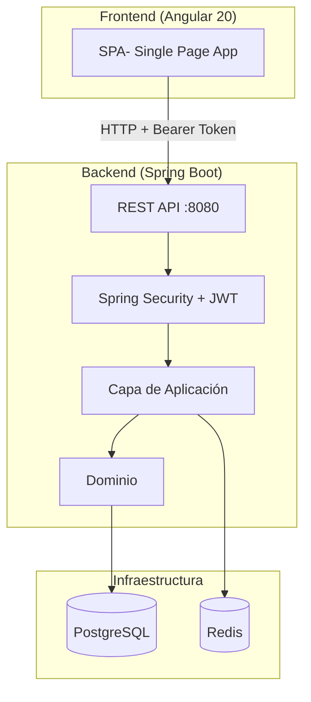

# MiVoto- Sistema de Votación Electrónica

MiVoto es una plataforma de votación electrónica diseñada para garantizar procesos electorales seguros, transparentes y auditables. El sistema implementa autenticación basada en JWT, control de acceso por roles, cifrado de votos y un rastro de auditoría completo.

## Componentes del Sistema

| Componente | Tecnología | Descripción |
|---|---|---|
| **Backend** | Spring Boot 3.2.1 + Java 17 | API REST, lógica de negocio, persistencia |
| **Frontend** | Angular 20 | SPA para votantes, administradores y supervisores |
| **Base de datos** | PostgreSQL | Almacenamiento principal de datos |
| **Caché** | Redis | Caché de elecciones activas |
| **Migraciones** | Flyway | Versionado del esquema de base de datos |

## Roles del Sistema

| Rol | Permisos |
|---|---|
| **VOTER** | Votar, ver elecciones activas, verificar voto, ver historial |
| **ADMIN** | CRUD completo de elecciones, candidatos y usuarios; ver auditoría y estadísticas |
| **SUPERVISOR** | Ver elecciones y resultados; acceso a estadísticas |
| **AUDITOR** | Acceso de solo lectura al registro de auditoría |

## Ciclo de Vida de una Elección

## Arquitectura General

## Secciones de la Documentación

- **[Backend](./backend/overview)**- Arquitectura hexagonal, base de datos, API REST, seguridad y estructuras de datos.
- **[Frontend](./frontend/overview)**- Arquitectura Angular, enrutamiento, autenticación y funcionalidades por rol.
- **[Integración](./integration/overview)**- Comunicación entre frontend y backend, flujo de autenticación end-to-end.
